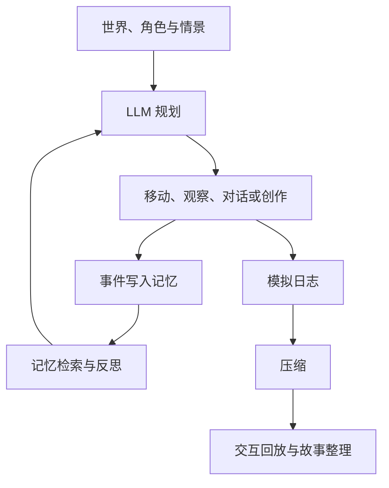

# 如鸢·广陵城 AI 小镇

> 一个以东汉末年广陵城为舞台、以角色记忆与大语言模型为驱动力的多智能体叙事实验。

本项目源于 [jiejieje/GenerativeAgents-Alien-Town](https://github.com/jiejieje/GenerativeAgents-Alien-Town)，并在其 Generative Agents 模拟、PixiJS 地图、启动器和 AIGC 创作能力之上，进行了《如鸢》主题的世界观重构、角色知识注入、回放交互增强与记忆驱动的文学创作改造。

这里关心的不只是“让 AI 角色在地图上活动”，而是一个更具体的问题：

> 当一群拥有身份、关系、长期记忆与个人目标的角色，被放入同一个历史情境，他们会如何理解局势、作出选择、彼此影响，并共同形成一段事先没有写好的故事？

项目目前处于持续实验阶段。已有功能与实验产物可以运行；“情景驱动的故事实验系统”是接下来重点建设的方向。

## 项目特色

### 广陵城世界模型

原有外星小镇被重新组织为东汉末年的广陵城，包括绣衣楼、广陵王府、议事厅、市集、乐坊、医馆、匠作坊与隐鸢阁别院等空间。

世界观资料不仅用于展示，也会通过提示词和角色配置参与 LLM 推理，以约束人物的语言、知识边界、社会关系与行动选择。

相关资料位于：

- `data/lore/世界观设定.md`：时代背景、组织、地点与模拟守则。
- `data/lore/角色设定/`：核心角色的完整人设与关系资料。
- `data/lore/地名映射.json`：上游地图语义到广陵城语义的映射。
- `data/prompts/base_desc.txt`：实际注入 LLM 上下文的世界观精简版。

### 角色记忆与自主行动

角色会根据当前环境、日程、关系和记忆进行感知、检索、规划、对话、行动与反思。一次事件可以进入长期记忆，并影响之后的计划和互动。

项目本地已构建近百位《如鸢》相关角色。五位核心角色——广陵王、傅融、孙策、左慈、刘辩——具有较完整的性格、经历、语言倾向、关系和生活计划；其余角色由资料整理与批量构造脚本生成，仍在持续深化。

### 兰台书案：记忆驱动的角色创作

本项目将上游的“生命游戏代码生成”场所改造成了“兰台书案”。当角色来到书案前，会结合自己的：

- 最近记忆；
- 固有性情；
- 身份与习得知识；
- 生活方式；
- 此前的创作经历；

自主选择诗、赋、书信、策论、随笔、谶纬短章等体裁进行文字创作。作品会保存到 `results/literary_records.json`，创作事件也会重新进入角色记忆，参与后续行为与创作。

这构成了一个初步的生成闭环：


### 可交互的故事回放

模拟结束后可以压缩并回放全过程。当前回放界面支持：

- 拖拽平移与鼠标锚点缩放；
- 一键全景；
- 空格播放或暂停；
- 点击角色查看活动轨迹；
- 查看角色的历史对话。

回放不仅是演示界面，也是观察角色行为、定位关键事件和整理故事素材的主要工具。

### 多模态 AIGC 能力

项目保留了上游的多模态创作接口：

- LibLibAI：根据角色状态生成绘画提示与图像；
- Suno：根据角色状态生成音乐；
- LLM：负责角色规划、对话、反思、总结与文学创作。

绘画和音乐接口来自上游工程；“兰台书案”及其角色记忆闭环是本项目当前重点发展的生成能力。

## 当前实验方式

目前可以选择一组角色、设定模拟起始时间与步数，让他们在广陵城中自由生活，再通过日志和回放观察结果。

项目正在向“情景驱动的故事实验”演进。当前已经加入首个可运行的互动原型，工作方式是：

1. 保持世界背景与人物核心设定相对稳定；
2. 为一次实验提供新的开场情景、公开事件和角色私有信息；
3. 让角色依靠自己的记忆、立场与关系作出决定；
4. 记录事件传播、关系变化、阵营形成与行动后果；
5. 从完整日志中抽取故事时间线、人物弧光与关键场景；
6. 使用同一情景重复运行，比较故事的稳定部分与涌现差异。

例如，一个情景可以是：

> 一封真假难辨的鸢报称董卓密使已潜入广陵。广陵王只知道密使可能与里八华有关；傅融掌握账目异常；刘辩认得密使使用的宫中暗语；孙策收到的江东军报却暗示这可能是一场调虎离山之计。角色是否共享信息、相信谁、采取什么行动，不由预写剧本决定。

### 互动原型：暴雨夜·停云客栈

仓库目前包含一个独立于旧批处理模拟的回合制垂直切片：

- 6 名参与角色与 6 轮局势；每轮保留 3 个 AI 主要行动阶段，角色席玩家的移动、交谈不消耗主要行动，搜查、交付、藏匿、治疗、冲突和逃脱等每轮最多 3 次；
- 可复用的两层客栈世界包；
- 每局由随机种子固定一整套案件变体：凶手、动机、手段、失踪关键物、专属痕迹与其他嫌疑人的清白解释同步变化；
- 冻结的客观真相、角色私有事实、个人目标与决策约束；
- 公告板及“角色必须实际看到公告才会获知”的传播机制；
- 每轮可从三条候选中广播一条全局公开情报，六名角色立即写入个人记忆；
- 36 张压力、信息、关系事件卡，每局展示过的卡不会再次出现，另有“静观其变”空事件；
- 延迟世界后果，例如官兵按时抵达、未保护的痕迹消失；
- 每个行动阶段先冻结角色视角、并行形成意图、统一裁定，再把结果写入各自记忆；角色可以先移动、再调查、再带着新线索交谈；
- 客栈 12 个地点均放置至少两类调查内容，共 34 个基础与案件变体对象，包含可拼合真相的证据、个人秘密和有客观解释的误导线索；
- 六名角色各有需要保护的个人秘密；发现他人秘密、找到真相碎片、交换对方尚未知晓的有效情报、隐藏自身秘密与终局投票都会形成可解释的个人得分；
- 每名角色保存私有的 2—3 轮战略计划、备选方案、怀疑对象和历次执行结果，并在新情报出现时修订而不是每轮重置；
- 开局可选择六名角色中的任意一名进入“角色席”：先观看那封被陆成称为“有假”的绝密鸢报展开，再阅读包含三段个人背景、临场回忆、秘密与任务的角色长卷；卷宗会收至页面边缘，并可随时重新展开；
- 角色席只展示本人的背景、目标、私有记忆、已识破的秘密与随身物品；地图只呈现玩家本人及同一位置的其他密探，玩家只能收到自己亲历或同室目睹的行动与对话，导演台仍保留全局观察；
- 角色席可随时自由移动和交谈，确认调查目标后再消耗有限的主要行动，也可主动结束本轮；主要行动后的发现和同室新动静会以居中反馈卡强调呈现；
- 无真人主持时，角色席提供“自动主持·展开下一轮”：由玩家决定何时继续，系统再从未使用的公开情报与合规事件卡中随机选择；
- 行动区提供随轮次、阶段、最新事件、当前位置与角色身份变化的“当前剧情”引导，说明此刻发生了什么、玩家现在要做什么，并给出可展开查看而不会替玩家决策的方向提示；
- 角色席的行动面板根据现场动态生成合法移动、搜查、交谈、交付、藏匿、冲突、治疗、逃脱与等待选项；交谈可指定一句公开说辞，并可选择一条真实记忆进行系统级交换；
- 实时地图与导演台双页面：一页逐条播放人物移动和对话，一页负责玩家干预；
- 导演台提供“掌柜席”主持目标、公告触达、局势阶段与干预次数反馈；随机事件与公开情报会在两页以浮动事件卡和鸢报展开；
- 每个人的行动向玩家公开，凶手身份、动机与内在计划在终局前隐藏；
- 存活、受伤、失能、濒死和死亡状态；
- 页面刷新和服务重启后的存档恢复；
- 第六轮第三次行动后由所有仍可表达意见的人依据个人记忆独立投票；角色席玩家必须亲自指认，之后才揭示凶手；
- 终局真相、六轮十八次行动时间线、公告触达、秘密传播、计分明细、投票理由与人物结局复盘。

互动引擎默认尝试使用 `data/config.json` 中的现有文本模型，也可以切换到本机 Ollama。在线模型按当前 AI 角色并发；本地单模型默认两路并发，避免显存拥堵。每个行动阶段都会重新调用规划器，请求只包含该角色的目标、私有记忆、当前计划、历次计划结果、当前位置、亲眼可见的人物/物品与本人知晓的事件；只有凶手请求会获得本局作案信息。模型不可用、输出不合法，或行动引用了不可见角色、非相邻地点和未持有物品时，只对该角色回退到启发式合法行动。

## 技术结构

```text
AI小镇启动器.py              图形化角色选择、配置与模拟入口
start.py                     模拟启动、继续运行与结果保存
modules/
  agent.py                   Agent 行动、对话、创作与记忆回写
  memory/                    事件、对话、计划、空间与关联记忆
  prompt/scratch.py          LLM 任务构造与输出解析
  model/                     模型调用
  interactive/               回合引擎、事件导演、LLM 意图、存档与复盘
data/
  lore/                      世界观、人物、关系与地名资料
  prompts/                   规划、对话、反思与创作提示词
  worlds/                    可复用空间世界包
  scenarios/                 情景真相、角色秘密、物品、事件卡与触发器
frontend/                    PixiJS 地图、实时界面与回放交互
scripts/                     地图改名、角色构造与素材处理脚本
results/                     模拟、回放、反思与 AIGC 创作记录
compress.py                  将模拟记录压缩为回放数据
replay.py                    启动回放 Web 服务
interactive_server.py        启动实时回合推演服务
```

核心运行链路：



## 快速开始

### 环境

- Python 3.9 或更高版本，推荐 3.10/3.11；
- Windows 是当前主要开发与测试环境；
- 至少配置一个可用的对话模型与 Embedding 服务；
- 绘画、音乐等外部服务为可选能力。

安装依赖：

```bash
pip install -r requirements.txt
```

### 配置模型

在 `data/config.json` 中配置模型和 Embedding 服务。真实 API Key 不应提交到 Git。现有代码兼容的服务配置可参考本地配置文件结构。

绘画、音乐服务是可选项；未配置时，对应创作能力可能不可用。不同服务的网络条件、费用和模型名称可能变化，请以各服务的当前文档为准。

### 使用图形启动器

```bash
python AI小镇启动器.py
```

启动器可用于创建用户角色、选择参与模拟的角色、修改人物设定并启动模拟。

### 使用命令行

启动“暴雨夜·停云客栈”互动推演：

```bash
python __main__.py interactive
```

然后访问实时地图：

```text
http://127.0.0.1:5001/interactive
```

导演台位于：

```text
http://127.0.0.1:5001/interactive/director
```

主页面开局可以选择“角色代入”或“全局观察”。角色代入后，点击展开的绝密鸢报进入角色长卷；读完点击卷宗外的空白处即可进入地图。右侧负责剧情引导、自由探索与三次主要行动，页面边缘的“你的角色 / 只有你知道”可随时重开卷宗。可以同时打开导演台进行人工主持，也可以直接在角色席点击“自动主持·展开下一轮”；每轮何时开始与何时提前结束都由玩家决定。

若要强制使用启发式规划、避免任何外部模型请求：

```powershell
$env:GA_INTERACTIVE_PLANNER="heuristic"
python __main__.py interactive
```

若要强制要求 LLM 配置可用（初始化失败时直接报错，而不是自动回退）：

```powershell
$env:GA_INTERACTIVE_PLANNER="llm"
python __main__.py interactive
```

使用本机 Ollama（默认模型可自行替换）：

```powershell
$env:GA_INTERACTIVE_PLANNER="llm"
$env:GA_INTERACTIVE_LLM_PROVIDER="ollama"
$env:GA_INTERACTIVE_OLLAMA_MODEL="qwen2.5:7b-instruct"
python __main__.py interactive
```

以下命令用于旧版批处理模拟与回放。

运行一次新模拟：

```bash
python start.py --name my_story --start "20240213-09:30" --step 60 --stride 10
```

继续已有模拟：

```bash
python start.py --name my_story --start "20240213-09:30" --step 60 --stride 10 --resume
```

压缩模拟结果：

```bash
python compress.py --name my_story
```

启动回放服务：

```bash
python replay.py
```

然后访问：

```text
http://127.0.0.1:5000/?name=my_story
```

也可以使用统一脚本入口：

```bash
python __main__.py start --name my_story --step 60
python __main__.py replay
python __main__.py interactive
```

> 统一入口仍处于实验状态；直接运行启动器或脚本是当前更常用的方式。

## 角色与素材重建

角色美术资源体积较大，没有全部纳入 Git。仓库保留了角色模板和构建脚本，用于在本地生成运行目录。

相关脚本包括：

- `scripts/build_ruyuan_agents.py`：构建五位核心角色及用户角色模板；
- `scripts/add_ruyuan_spies.py`：根据整理后的角色资料批量生成其他角色；
- `scripts/fetch_ruyuan_art.py`：获取和处理角色形象素材；
- `scripts/apply_ruyuan_rename.py`：更新地图与角色空间记忆中的地名；
- `scripts/build_place_labels.py`：生成地图地点标签。

部分脚本依赖作者本地整理的数据源或第三方公开资料，当前还不是完全开箱即用的发布流程。后续需要补充可公开的数据清单、缓存策略和重建说明。

## 已有实验产物

- `results/compressed/`：多次模拟的压缩回放与可阅读日志；
- `results/literary_records.json`：角色在兰台书案前生成的文学作品；
- `results/reflection-records/`：角色反思记录；
- `results/music-records/`：音乐创作记录；
- `frontend/static/generated_images/`：生成图像；
- `frontend/static/generated_music/`：生成音乐。
- `results/interactive/<game_id>/state.json`：互动局当前完整状态；
- `results/interactive/<game_id>/round-XX.json`：逐轮结构化事件；
- `results/interactive/<game_id>/recap.json` 与 `recap.md`：终局真相、投票和人物复盘；
- `results/interactive/<game_id>/story-outline.json` 与 `story-outline.md`：基于事件证据的三幕故事提纲。

这些记录目前主要用于调试和观察。后续计划把它们进一步整理为事件时间线、人物视角摘要、关系变化和可阅读故事。

## 当前局限

项目仍有不少明确的问题：

- 大量批量角色只有身份、籍贯、羁绊和通用生活模板，尚未达到核心角色的人设深度；
- 世界设定主要通过全局提示词注入，缺少按角色身份和情景动态检索的知识系统；
- 首个互动原型已经接入在线与本地 LLM 并完成连续回合验证，但仍需通过多局实测改善行动有效率、对话连续性、欺骗策略和投票质量；
- 文学创作可能重复，目前主要通过提示词与采样参数缓解；
- 互动局已经生成结构化事件和证据复盘，但尚未完成多视角文学故事编排；
- 尚未建立角色一致性、关系一致性、情景完成度与故事多样性的评估体系；
- 百人同时模拟适合压力测试，却不一定适合形成聚焦、可读的故事；
- 角色与美术资源的重建流程仍依赖部分本地数据。

公开这些局限，是为了区分已经完成的功能、正在验证的假设与未来设想。

## 路线图

- [x] 将情景建模为结构化数据：背景、导火索、公开事实、秘密、目标和阶段事件；
- [x] 支持角色私有知识与差异化信息注入；
- [x] 实现公告板、公开情报、36 张不重复事件卡、空事件、回合存档和终局证据复盘；
- [x] 实现双页面实时地图、逐条行动/对话追踪、隐藏凶手、逃脱与全员记忆投票；
- [x] 完成六角色并行 LLM 决策、角色级信息隔离、非法行动回退与真实浏览器验证；
- [x] 实现跨回合私人战略计划、Ollama 本地模式、掌柜席反馈与浮动事件卡/鸢报演出；
- [x] 实现 6 轮 × 3 行动、多阶段重规划、全地点线索/秘密、情报交换计分与开局选角的第一人称玩家决策；
- [ ] 基于多局记录继续调优 LLM 对话连续性、欺骗策略与投票质量；
- [ ] 建立核心人物档案、关系图和不可违背的角色约束；
- [ ] 从模拟日志自动抽取事件、因果链和关系变化；
- [ ] 生成多视角故事梗概、章节草稿与角色小传；
- [ ] 对同一情景进行多次运行与差异比较；
- [ ] 建立人物一致性、重复率、因果连贯性和故事可读性评估；
- [ ] 整理角色数据来源与一键重建流程；
- [ ] 提供精简、可公开复现的示例情景与演示结果。

## 项目来源与个人改造边界

本项目建立在以下开源工作的基础上：

- [jiejieje/GenerativeAgents-Alien-Town](https://github.com/jiejieje/GenerativeAgents-Alien-Town)：直接上游，提供模拟器、启动器、地图界面及绘画、音乐、代码生成等能力；
- [x-glacier/GenerativeAgentsCN](https://github.com/x-glacier/GenerativeAgentsCN)：上游所基于的中文 Generative Agents 框架；
- [Stanford Generative Agents](https://github.com/joonspk-research/generative_agents)：生成式智能体的研究与原始实现；
- [PixiJS](https://github.com/pixijs/pixijs)：地图渲染与交互。

本仓库当前的主要改造包括：

- 《如鸢》广陵城世界观、地点语义与核心人物配置；
- 角色资料整理和批量构造脚本；
- 地图中文标签与主题资源；
- 回放地图交互、角色活动历史和对话查看；
- 将生命游戏代码生成改为“兰台书案”文学创作；
- 将文学作品作为角色事件重新写入记忆；
- 多轮模拟、回放与故事实验资料。

为避免混淆，上游已有功能与本项目新增内容会在后续文档中继续明确标注。

## 版权与许可

代码沿用仓库中的 Apache License 2.0，详见 `LICENSE`。

《如鸢》及相关角色、设定与美术素材的权利归其原权利人所有。本项目为个人学习、技术研究与非商业创作实验，不代表或隶属于游戏官方。使用、分发或展示相关素材时，请自行确认来源、授权范围与适用规则。

## 项目状态

这是一个仍在生长的个人项目。当前重点不是堆叠更多生成接口，而是让世界背景、人物记忆、情景压力与故事结果真正发生联系。

如果你对多智能体叙事、角色一致性、互动故事、AIGC 创作或模拟评估感兴趣，欢迎通过 Issue 提出建议或分享实验情景。
