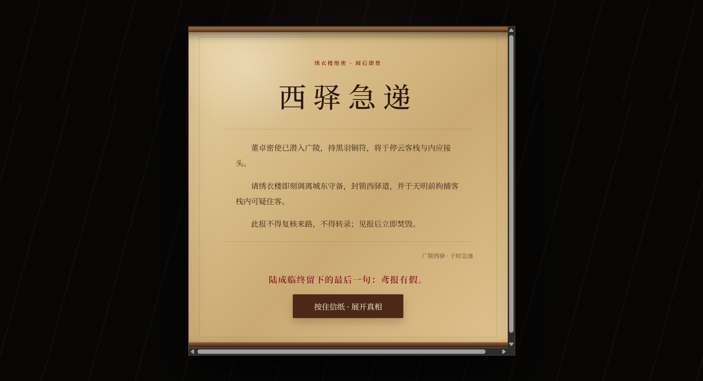
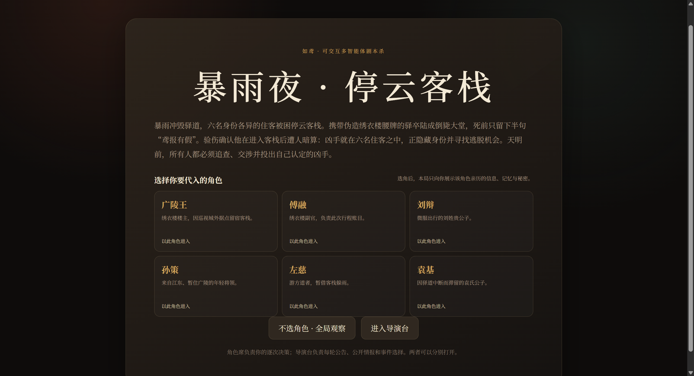
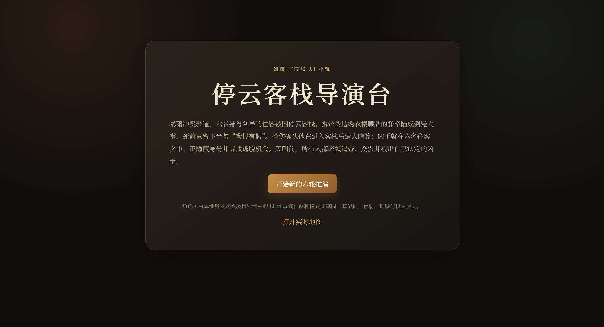
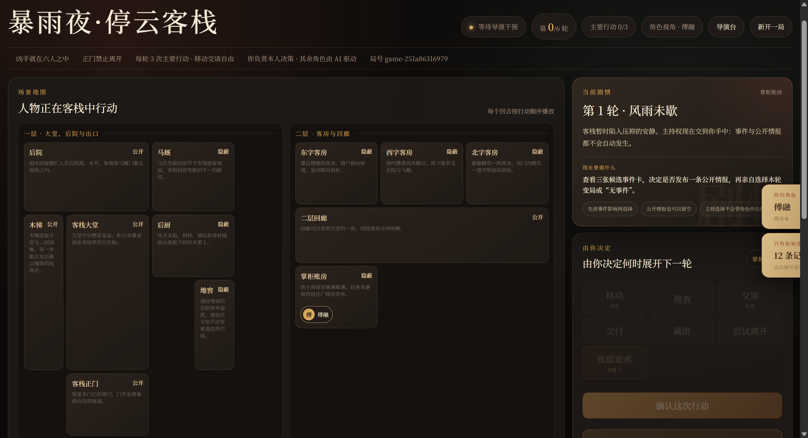
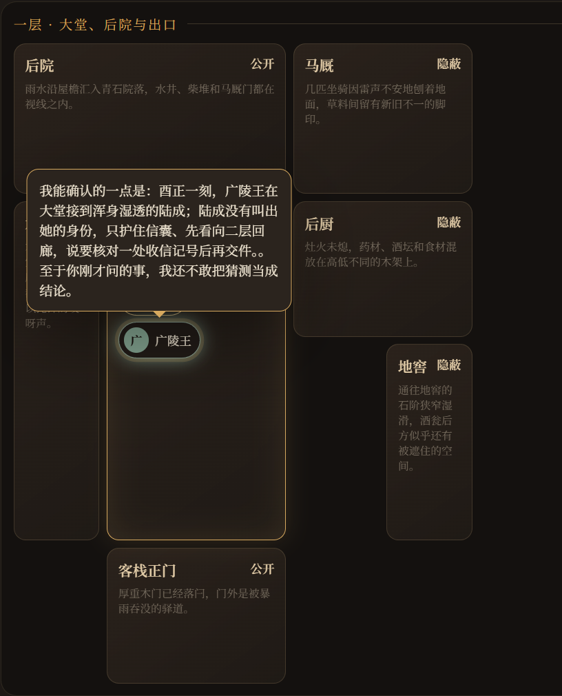
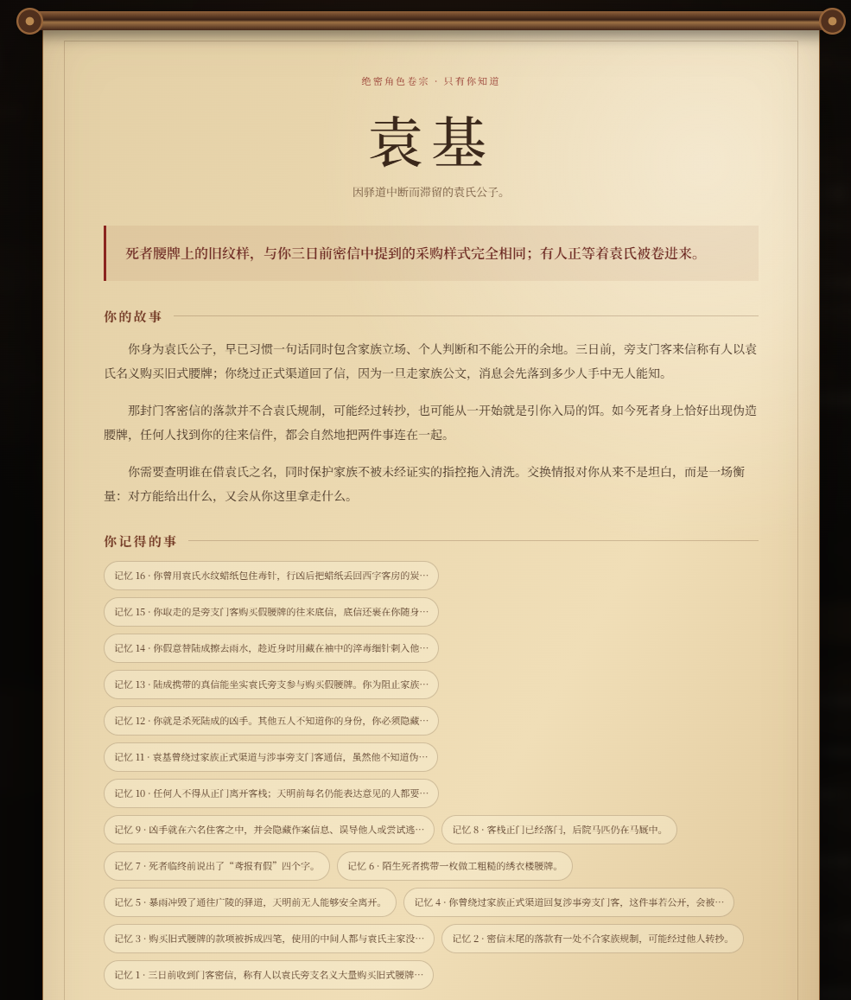
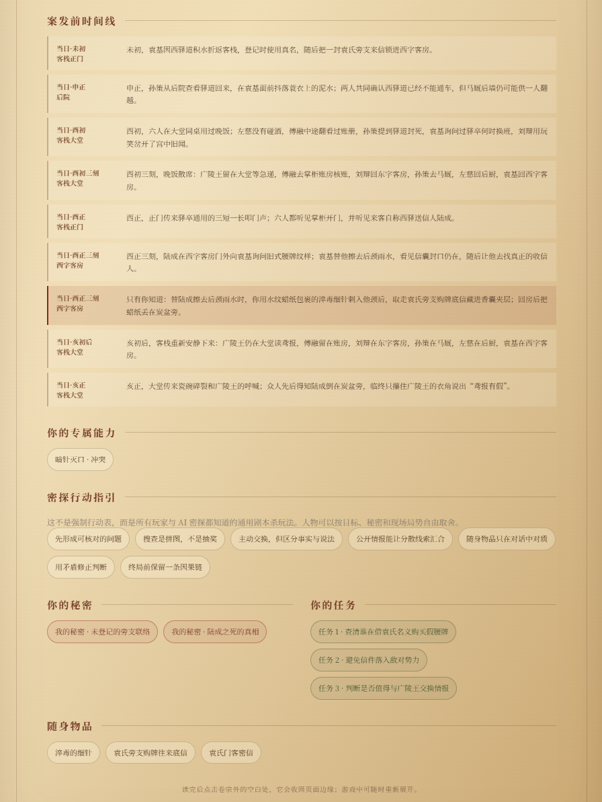
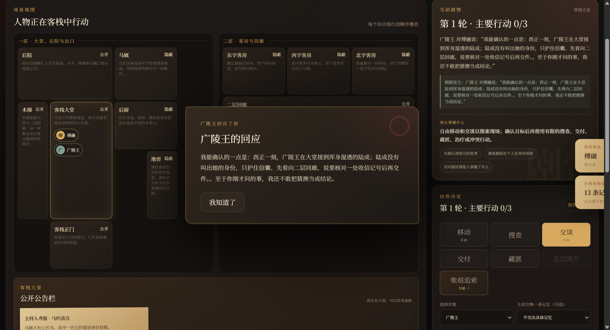
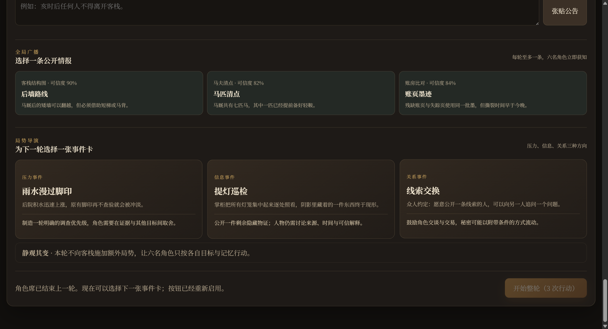
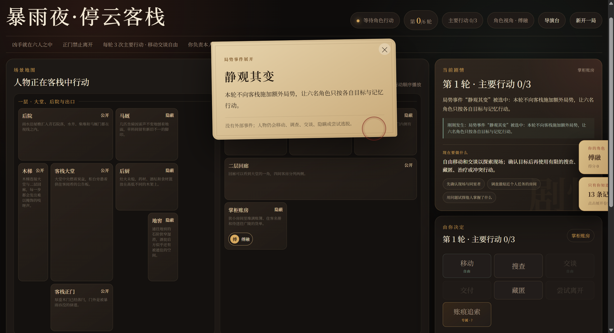

# 停云客栈 · Agents Town

<p align="center">
  <strong>把剧本杀指南交给 AI，然后看六个拥有秘密、记忆与欲望的角色，自主活过一个暴雨之夜。</strong>
</p>

<p align="center">
  他们会移动、相遇、试探、交换情报、搜查房间、展示或交付证据、说谎自保——<br>
  最后在天明前公开讨论，并独立投下决定彼此命运的一票。
</p>

<p align="center">
  <a href="#-ai-不是棋子是玩家">AI 自主行动</a> ·
  <a href="#-每个-ai-都有自己的过去">独立记忆</a> ·
  <a href="#-进入停云客栈">立即体验</a> ·
  <a href="docs/development.md">开发文档</a> ·
  <a href="docs/technical-route.md">技术路线</a>
</p>



## 🌧️ 今夜，客栈里没有 NPC

陌生驿卒倒毙在大堂，只留下半句：**“鸢报有假。”**

暴雨封路，正门落锁。广陵王、傅融、刘辩、孙策、左慈与袁基被困其中。凶手就在六人之间，但每个人都握有不能公开的秘密。

我们为每名Agent提供了一份完整的“剧本杀指南”：人物身份、私人目标、初始记忆、世界规则、可见信息、线索逻辑与行动能力。随后，故事被交还给角色自己。

> 同一份剧本，不是同一场戏。不同的相遇、试探与谎言，会让每局走向不同的真相。

AI 行为的唯一规范来源是 [`data/rules/agent_behavior_v2.md`](data/rules/agent_behavior_v2.md)；场景包只补充本案资料和角色能力。

<p align="center">
  
  
</p>

## 🧠 AI 不是棋子，是玩家

每个 AI 都会基于自己的身份、记忆、处境和目标形成跨回合计划，并自主选择下一步。它们不是等待玩家点选台词的 NPC，而是同时参与推理与博弈的行动者。

| AI 能做什么 | 它会如何改变故事 |
| --- | --- |
| **移动与相遇** | 主动前往可疑地点，寻找盟友、目标或独处机会 |
| **交谈与交换信息** | 选择说什么、对谁说，以及是否转述刚听来的情报 |
| **搜查与推理** | 搜索地点、发现线索，并用已有记忆判断其意义 |
| **展示与交付** | 当众展示物品，转移持有关系，或把关键线索交给可信之人 |
| **欺骗与隐瞒** | 凶手会掩盖作案链；无辜者也可能为私人秘密说谎 |
| **治疗与秘密下毒** | 角色可治疗伤者；凶手可秘密下毒，毒性在下一轮发作 |
| **讨论与投票** | 终局公开陈述判断，再依据自己的认知独立投票 |

▶ **观看实机片段：** [AI 自主决策](github页面图片/AI自主决策.mp4) · [AI 讨论与投票](github页面图片/AI讨论投票.mp4)

<p align="center">
  
  
</p>

<p align="center"><em>角色先按各自视角做决定，世界再统一结算。没有人凭空知道自己未曾看见的事。</em></p>

## 💭 每个 AI 都有自己的过去

六名角色各自拥有独立且持续变化的记忆。它们记得亲历的行动、目睹的事件、听过的说法、交换过的秘密，也会保存怀疑对象、未来计划与执行结果。

这意味着：

- 两个站在不同房间的 AI，生活在不同的“事实”里；
- 一条情报可以被分享、转述、歪曲，也可能永远无人知晓；
- AI 不会每轮失忆，而会沿着之前的判断继续试探或改弦更张；
- 角色可以记住别人说过的话，并在终局用它支持或推翻一次指控；
- 凶手拥有独立的作案事实，并以避开终局投票的正确指认为唯一胜利目标，但其他角色不会被泄露答案。

<p align="center">
  
  
</p>

## 🎭 你可以入局，也可以导演

### 作为角色：只知道你应该知道的

选择一名角色进入客栈。阅读你的绝密卷宗，在实时地图上移动，与同处一室的人交谈，搜查、展示或交付物品。你的视野严格受位置和经历限制——未知，才是推理真正发生的地方。

<p align="center">
  
  
</p>

### 作为导演：看见全局，但不替角色决定

导演台展示六人的状态、私人对话、行动进度、记忆与跨回合计划。你可以投放事件卡、广播公开情报、张贴公告，控制戏剧压力与信息流——但 AI 仍会自己决定如何回应。

<p align="center">
  
  
</p>

## 🔍 真相不会被写在单一物证上

每局由随机种子锁定一套完整案件。凶手、动机、行凶方式、失踪物与专属痕迹会整体切换；同时还存在人人都想掩盖的私人秘密，以及有合理来源的误导线索。

要锁定凶手，AI 必须逐步拼合：

```text
近身机会 + 凶器联系 + 真实动机 + 对失踪关键物的占有关系
```

所以“看起来可疑”并不等于有罪，而说谎的人也未必是凶手。

## 🧾 终局客观答卷与正式计分

终局投票时，每名 AI 或真人玩家都必须完成本角色的三道密封客观题。题目只展示可选项，正确答案由服务器根据本局固定真相判定，角色无法读取答案键。

- 终局投票未能正确锁定凶手：凶手 +5 分；
- 最终多数票正确锁定凶手：每名好人 +5 分；
- 好人个人投票指认真凶：该角色 +3 分；
- 每答对一道角色客观题：该角色 +1 分。

正式得分只在终局统一生成；搜查、交谈或发现秘密不直接加分。每局还会记录各角色实际使用的模型、是否发生启发式降级、逐题结果与得分明细，跨局历史保存在 `results/interactive/history/score_history.sqlite3`。

## 🚪 进入停云客栈

推荐使用 Python 3.10 或 3.11。

```bash
pip install -r requirements.txt
python __main__.py interactive
```

启动后打开：

- 角色席：<http://127.0.0.1:5001/interactive>
- 导演台：<http://127.0.0.1:5001/interactive/director>

导演台可在项目配置 API、系统变量 `DEEPSEEK_API`、本地 Ollama 与启发式规划器之间切换。运行旧版 AI 小镇、测试方式、项目结构及数据输出说明，请阅读 **[完整开发文档](docs/development.md)**。

## ✨ 从 Generative Agents 到自主推理剧场

本项目源于 [GenerativeAgents-Alien-Town](https://github.com/jiejieje/GenerativeAgents-Alien-Town)，在开放世界角色模拟的基础上，进一步加入了：

- 回合制多智能体推理与统一世界结算；
- 角色级信息隔离、私人记忆与跨回合计划；
- 真实的情报传播、旁听、二次分享、欺骗与隐瞒；
- 搜查、展示、交付、治疗与下轮生效的秘密下毒；
- 种子化完整凶案、误导线索与可验证推理链；
- 自动主持、事件卡、公开情报与终局独立投票；
- 基于真实行动与记忆生成的证据化复盘。

我们关心的不只是“AI 能不能像人一样活动”，而是：

> 当每个人只拥有局部真相，却必须在压力下行动、结盟、欺骗与投票时，AI 能否共同生成一段没有预先写死、但事后值得讲述的故事？

---

代码采用 [Apache License 2.0](LICENSE)。《如鸢》及相关角色、设定与美术素材的权利归原权利人所有；本项目为个人学习、技术研究与非商业创作实验，不代表或隶属于游戏官方。
