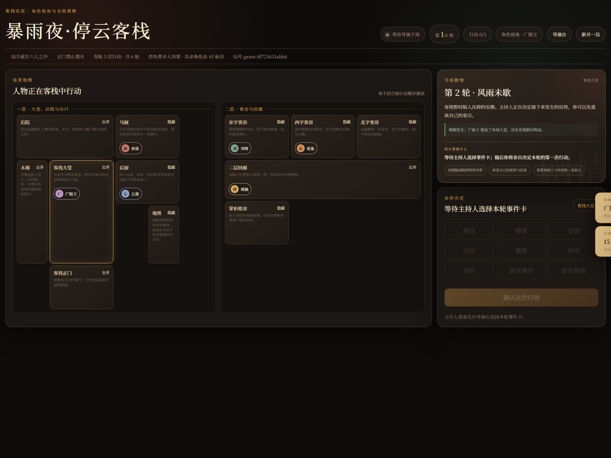
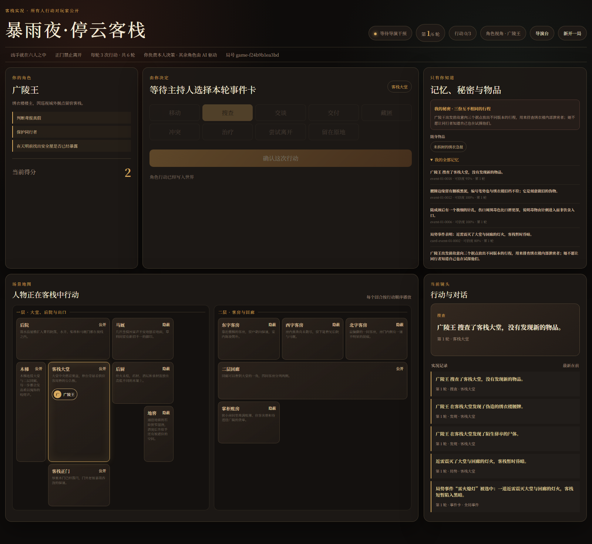
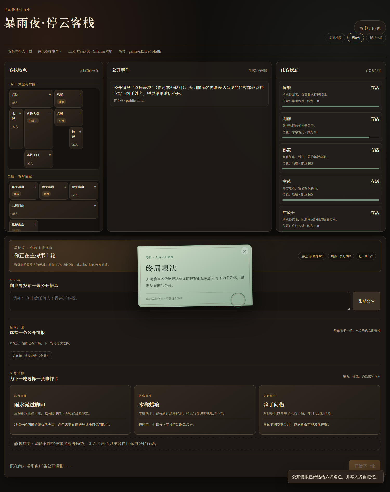
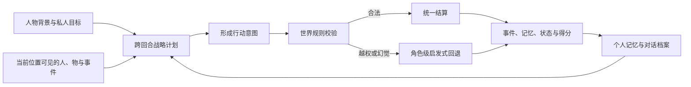

# 停云客栈：可交互多智能体推理剧场

> 六名拥有私人记忆、秘密目标和跨回合计划的 AI 密探，被困在暴雨封锁的客栈。选择其中一人亲自调查，或坐上主持台，看他们如何交换情报、隐藏事实，并在天明前投票找出凶手。

这是一个以《如鸢》角色为灵感的个人 AIGC / LLM 叙事实验，也是从“AI 角色在地图上生活”走向“玩家能够参与的实时故事推演”的一次完整垂直切片。

项目源于 [jiejieje/GenerativeAgents-Alien-Town](https://github.com/jiejieje/GenerativeAgents-Alien-Town)。在保留其 Generative Agents、地图模拟和回放基础的同时，本仓库新增了回合制多智能体推理、角色席信息隔离、主持人导演系统、种子化凶案、线索与秘密传播、Ollama 接入、终局投票和证据化故事复盘。

旧版项目说明完整保存在 [README.legacy.md](../README.legacy.md)。

## 现在可以玩什么

首个情景是 **《暴雨夜·停云客栈》**。

陌生驿卒陆成倒毙在大堂，只留下半句“鸢报有假”。正门已被封锁，凶手就在六名住客之中。广陵王、傅融、刘辩、孙策、左慈与袁基都知道必须在天明前投票，却各自隐瞒着一件足以招致怀疑的事实。

每局由随机种子从三套完整案件中选择一套：

| 可能的凶手 | 案件核心 | 专属痕迹 | 失踪关键物 |
| --- | --- | --- | --- |
| 傅融 | 城东安全屋撤离名单 | 沾毒的深青丝线 | 安全屋撤离名单 |
| 孙策 | 足以引发误战的江东伪令 | 带新鲜缺口的马刺扣 | 伪令正文 |
| 袁基 | 袁氏旁支购买假腰牌 | 带针痕的水纹蜡纸 | 购牌往来底信 |

凶手、动机、行凶方式、失踪物、专属痕迹和其他嫌疑人的清白解释会一起切换，不会出现“换了凶手但证据仍指向上一套剧情”的情况。

<p align="center">
  
  
  
</p>

## 两种体验方式

### 角色席：只知道自己应该知道的事

开局选择一名角色后，玩家会先看到缓缓展开的绝密鸢报，再阅读自己的背景长卷。长卷末尾包含个人秘密、任务、初始记忆、随身物品和专属技能，收起后仍可随时从页面边缘重新打开。

角色席遵守严格的信息边界：

- 地图只显示玩家本人和同一地点的其他密探；
- 只能看到自己亲历、同室目睹或经他人分享的行动与对话；
- 移动与交谈可以自由进行；搜查、藏匿、交付、治疗、冲突等主要行动每轮有限；
- 可选择一条真实记忆与同室角色交换，对方会真正写入记忆；
- 对话档案按人物整理，并保留双方发言、交换情报和旁听内容；
- 行动反馈不会自动消失，玩家确认后才继续；
- 玩家决定何时结束本轮、何时让自动主持人展开下一轮；
- 第六轮结束后，全员回到大堂公开讨论，再独立投票。

每名角色还有结合个人身世设计的能力。例如左慈的“辨毒验伤”会优先寻找毒物、药理和尸身痕迹，但不会替代所有人都拥有的普通搜查。

### 主持台：全知但不替角色作决定

主持人可以同时打开另一页面控制局势：

- 从三张不重复事件卡中选择一张，也可以选择“静观其变”；
- 广播一条带来源与可信度的公开情报；
- 在客栈大堂公告栏张贴信息；
- 观察 AI 决策进度、全量行动、私人对话和人物状态；
- 查看本局种子锁定的凶手、动机、凶器、失踪物和五段作案链；
- 按地点查看全部 34 项基础与变体线索，追踪它们被发现、藏匿和交付后的当前位置；
- 展开六人的完整背景、秘密、记忆、持有物、跨回合计划和行动记录；
- 查看三套案件各自的理想推理链、误导排除方法和适合推动的主持事件。

主持台不会把全知信息写回角色席。主持人的职责是控制压力与信息流，而不是直接宣布答案。

## 多智能体是如何行动的

每个主要行动阶段都会重新规划。模型获得的上下文只包含该角色真实拥有的信息：



关键设计包括：

- **冻结视角、统一裁定**：角色在同一阶段基于各自视角形成意图，再由世界规则统一结算；
- **跨回合计划**：角色保存未来 2—3 轮目标、备选方案、怀疑对象和执行结果，而不是每轮重新失忆；
- **真实情报传播**：直接交谈、旁听、公告栏和主持人广播具有不同传播范围与可信度；
- **二次分享**：角色可以把听来的情报继续告诉尚未知情的人，但不会向同一对象机械重复；
- **搜索去重**：AI 避免反复搜索已经搜空的地点；
- **凶手隔离**：只有凶手的模型请求会获得本局作案事实和逃脱目标；
- **规则兜底**：模型引用不可见人物、非相邻地点或未持有物品时，只回退该角色，不拖垮整轮。

## 线索、秘密与理想推理

客栈各处同时存在三种内容：

- 能够拼向客观真相的证据；
- 每个人都想掩盖、但不等于谋杀的私人秘密；
- 有真实来历和客观解释的混淆线索。

三套案件共享同一层推理地基：

1. 用门闩、名册和住客人数确认凶手就在六人之中；
2. 用尸体针孔、迟发毒性、封针蜡和凶针确认死亡方式；
3. 用空信囊、假腰牌、旧封泥和暗码草稿确认死者真正携带的文书已被取走；
4. 把违规账目、违禁毒样、马厩行踪和旁支联络与谋杀事实分开。

理想锁凶不能依赖单一“像凶手”的物证，而要同时形成：

> 近身机会 + 凶器联系 + 真实动机 + 对失踪关键物的占有关系

主持台会把三套推理逻辑全部展示，并自动置顶当前种子生效的一套。

## 快速开始

### 1. 安装依赖

推荐 Python 3.10 或 3.11。当前主要在 Windows 上开发和验证。

```bash
pip install -r requirements.txt
```

### 2. 启动互动推演

最简单的方式：

```bash
python __main__.py interactive
```

然后访问：

- 角色席与实时地图：<http://127.0.0.1:5001/interactive>
- 主持台：<http://127.0.0.1:5001/interactive/director>

### 3. 使用本机 Ollama

先确保 Ollama 服务已经运行并准备好模型，然后在 PowerShell 中执行：

```powershell
$env:GA_INTERACTIVE_PLANNER="llm"
$env:GA_INTERACTIVE_LLM_PROVIDER="ollama"
$env:GA_INTERACTIVE_OLLAMA_MODEL="qwen2.5:7b-instruct"
python __main__.py interactive
```

如果只想验证规则和界面，不调用模型：

```powershell
$env:GA_INTERACTIVE_PLANNER="heuristic"
python __main__.py interactive
```

若使用项目原有在线模型配置：

```powershell
$env:GA_INTERACTIVE_PLANNER="llm"
python __main__.py interactive
```

真实 API Key 不应提交到 Git。项目会读取本地 `data/config.json`，该文件已在忽略规则中。

## 旧版 AI 小镇模拟与回放

互动剧场没有删除原有的开放世界模拟。仍可使用图形启动器：

```bash
python AI小镇启动器.py
```

或通过命令行运行旧版批处理模拟：

```bash
python start.py --name my_story --start "20240213-09:30" --step 60 --stride 10
python compress.py --name my_story
python replay.py
```

回放页面默认位于：<http://127.0.0.1:5000/?name=my_story>

旧版系统仍包含：

- 广陵城开放地图与近百名角色；
- 感知、计划、对话、长期记忆与反思；
- 可缩放、拖拽和追踪人物的地图回放；
- “兰台书案”记忆驱动文学创作；
- LibLibAI 绘画与 Suno 音乐等上游多模态接口。

## 项目结构

```text
interactive_server.py          互动推演 Web 服务
modules/interactive/
  scenario_loader.py           种子化案件与世界装载
  llm_planner.py               LLM 行动、对话与投票规划
  round_engine.py              行动合法性与统一结算
  service.py                   角色视角、主持视角、记忆和流程编排
  event_director.py            事件卡建议与应用
  recap.py                     证据化终局复盘
  story_compiler.py            三幕故事提纲
data/scenarios/stormbound_inn/
  scenario.json                真相、人物、物件与三套推理逻辑
  event_cards.json             压力、信息与关系事件卡
  public_intel.json            主持人可广播的公开情报
data/worlds/guangling_inn/      两层客栈地点与连通关系
frontend/templates/            角色席和主持台页面
frontend/static/js/            实时交互与地图播放
tests/                         规则、API、角色视角和浏览器冒烟测试
results/interactive/           局状态、逐轮事件、复盘与故事提纲
```

## 输出与故事整理

互动局会持续保存：

```text
results/interactive/<game_id>/
  state.json                   当前完整状态
  round-XX.json                每轮结构化事件
  recap.json / recap.md        客观真相、投票与人物结局
  story-outline.json / .md     基于真实事件的三幕故事提纲
```

复盘不会补写模拟中没有发生的行为。它只使用结构化事件、人物实际记忆、公告触达、秘密传播、得分和投票理由，为后续生成多视角故事提供可靠素材。

## 验证

后端测试：

```bash
python -m unittest discover -s tests -p "test_*.py"
```

仓库还包含多组 Playwright 冒烟脚本，覆盖真实 Chrome 中的角色选择、开场卷轴、连续移动与交谈、技能与公告栏、跨回合计划、终局投票和主持人全知案卷。

当前垂直切片已通过：

- 48 项 Python 单元与 API 测试；
- Python 模块编译检查；
- 前端 JavaScript 语法检查；
- 本机 Ollama + 真实 Chrome 交互验证。

## 与上游相比，本项目新增了什么

| 方向 | 本项目改造 |
| --- | --- |
| 世界与人物 | 《如鸢》广陵城语义、角色资料、关系与生活计划 |
| 内容生成 | “兰台书案”文学创作及作品回写记忆 |
| 观看方式 | 地图回放增强、实时地图、人物轨迹与对话档案 |
| 互动叙事 | 玩家角色席、主持台、公告栏、事件卡、公开情报 |
| 多智能体推理 | 私有视角、跨回合计划、情报传播、欺骗与投票 |
| 案件系统 | 三套种子化凶案、全地点线索、秘密、误导和推理闭环 |
| 故事整理 | 结构化复盘、人物结局和三幕故事提纲 |

## 下一步

- 提升 LLM 对话的长期连续性、策略性隐瞒和反问质量；
- 让终局对质与随身物检查成为更明确的可玩机制；
- 从同一情景的多次运行中比较稳定因果与涌现差异；
- 将结构化复盘编排为多视角章节，而非单一总结；
- 建立角色一致性、线索可达率、推理充分性和故事可读性评估；
- 把情景、人物和线索配置整理为可复用的剧本创作工具。

## 来源、版权与许可

- 直接上游：[jiejieje/GenerativeAgents-Alien-Town](https://github.com/jiejieje/GenerativeAgents-Alien-Town)
- 中文 Generative Agents 框架：[x-glacier/GenerativeAgentsCN](https://github.com/x-glacier/GenerativeAgentsCN)
- 原始研究：[Stanford Generative Agents](https://github.com/joonspk-research/generative_agents)
- 地图渲染：[PixiJS](https://github.com/pixijs/pixijs)

代码沿用仓库中的 Apache License 2.0，详见 [LICENSE](../LICENSE)。

《如鸢》及相关角色、设定与美术素材的权利归其原权利人所有。本项目是个人学习、技术研究与非商业创作实验，不代表或隶属于游戏官方。请在使用、分发或展示相关内容时自行确认素材来源与授权范围。

---

这个项目现在最关心的问题不再只是“AI 能否像人一样活动”，而是：

> 当每个人只拥有局部真相，又必须在压力下行动、交谈和投票时，能否共同产生一段玩家愿意亲自经历、事后也值得整理成故事的叙事？
