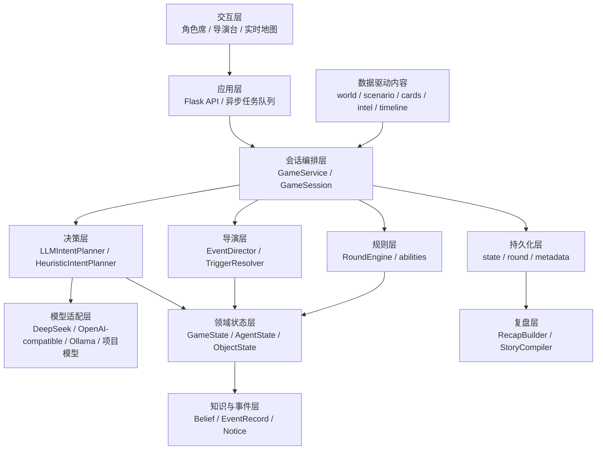
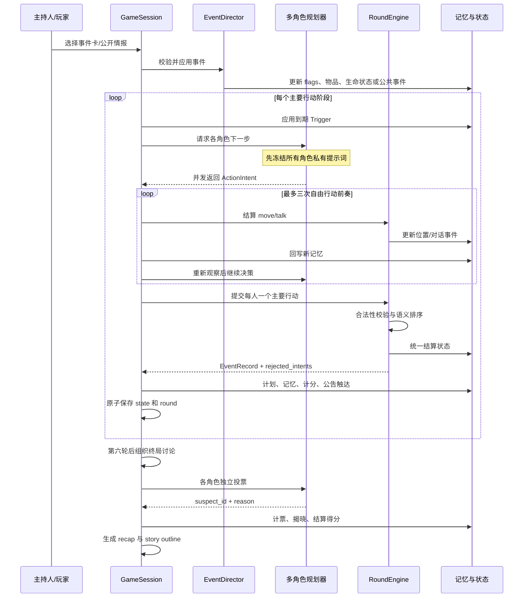
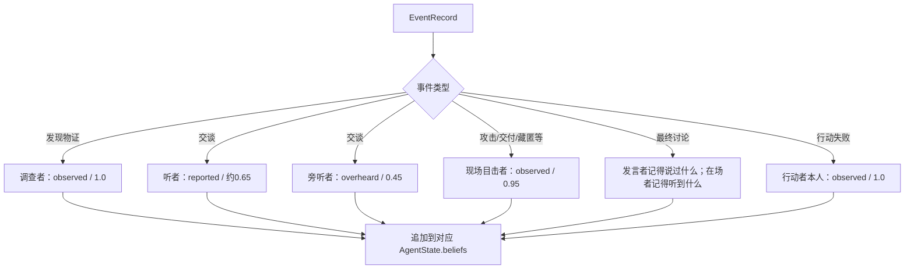
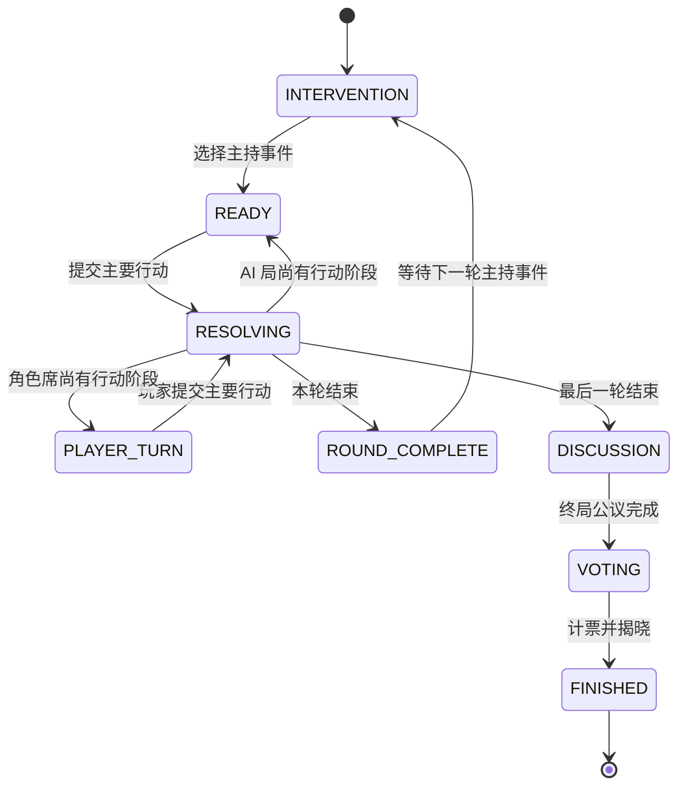
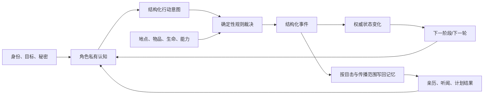

# Agents Town 技术路线与实现说明

> 文档定位：面向项目开发者、研究者和后续维护者，系统说明本仓库如何实现多智能体协作、AI 拟人化决策、任务规划、记忆管理、工具调用、状态管理，以及这些能力如何共同组成一个可交互、可追溯、可复盘的叙事模拟系统。
>
> 当前主线：本文以“停云客栈”互动推理引擎为主，同时说明它与原始 Generative Agents 开放世界模拟的继承关系。
>
> 最后核对：2026-07-24。

---

## 1. 一句话技术路线

本项目采用的是一条“**大语言模型负责提出角色化意图，确定性规则引擎负责校验与结算，事件与私有记忆负责持续塑造下一次决策**”的混合技术路线。

它既不是单纯让 LLM 自由续写故事，也不是传统有限状态机驱动 NPC，而是把系统拆成四个相互约束的部分：

1. **角色智能层**：每个角色拥有独立身份、目标、秘密、记忆和跨回合计划，由 LLM 或启发式规划器生成下一步意图。
2. **世界规则层**：位置、连通关系、物品归属、能力、生命状态、行动次数和阶段规则由代码确定性裁定。
3. **信息传播层**：事件不会自动成为全员知识，只会按亲历、目击、听闻、公告和公开事件的传播规则写入相应角色记忆。
4. **叙事编排层**：主持事件、延迟触发、终局投票、结构化复盘和故事提纲建立在真实发生的事件上，不反向篡改角色决策。

核心原则可以概括为：

```text
角色可以自由思考，但不能自由改写世界；
模型可以提出行动，但只有规则引擎能够宣布结果；
角色只能依据自己知道的内容决策；
最终故事必须能够追溯到真实事件和状态变化。
```

---

## 2. 项目演进：两代智能体系统

仓库中实际并存两套相互关联、但运行方式不同的智能体架构。

### 2.1 第一代：开放世界 Generative Agents

第一代系统以 `modules/agent.py` 为中心，模拟角色在连续时间和二维地图中的日常生活。它的典型循环是：


这套系统擅长：

- 长时间尺度的生活模拟；
- 日程生成和活动分解；
- 基于地图范围的感知；
- 向量记忆检索；
- 角色关系和自然对话；
- 由记忆累积触发反思；
- 绘画、音乐、文学创作等开放式外部能力。

它的主要局限是：

- 多角色通常按游戏循环依次更新，先后顺序容易进入故事因果；
- LLM 输出较自由，规则边界和信息隔离不够严格；
- 适合“生活涌现”，但不天然适合高约束的推理、欺骗、物证和投票；
- 很难保证某条叙事事实究竟是谁知道、何时知道、从哪里知道。

### 2.2 第二代：互动推理剧场

第二代系统以 `modules/interactive/` 为中心，把开放世界中的“自主性”保留下来，同时增加：

- 独立角色视角；
- 冻结上下文后的并发决策；
- 结构化行动协议；
- 确定性行动校验与统一结算；
- 事件级传播范围；
- 来源化信念；
- 跨回合战略计划；
- 主持事件和公开情报；
- 种子化案件真相；
- 终局独立讨论与投票；
- 可审计的状态、轮次日志和复盘。

第二代系统的重点不再只是“角色像人一样生活”，而是：

> 多个只掌握局部事实、目标彼此冲突、甚至有人刻意欺骗的智能体，能否在同一规则世界里共同形成可验证的行动链和叙事结果。

### 2.3 两代系统的继承关系

| 能力 | 开放世界版本 | 互动推理版本 |
| --- | --- | --- |
| 人设 | `Scratch` 基础描述、生活方式、当前状态 | 情景参与者的背景、公开身份、目标、决策规则、秘密 |
| 感知 | 地图视野半径、同场景事件 | 当前地点、同地点人物、可见物品、已触达公告、已知事件 |
| 记忆 | 向量索引中的 event/thought/chat | 带来源、置信度、立场和传播记录的 `Belief` |
| 计划 | 24 小时日程和分解活动 | 未来 2—3 轮战略计划、嫌疑人和备选方案 |
| 决策 | 多次提示词决定活动、地点、交流 | 一次结构化 JSON 意图加计划修订 |
| 行动 | 地图移动、活动占用、对话 | 移动、调查、交谈、公告、交付、藏匿、治疗、攻击、逃脱、等待 |
| 世界裁决 | 角色循环直接更新地图对象 | `RoundEngine` 统一校验和结算 |
| 信息边界 | 主要依赖地图感知 | 玩家视图、角色视图、公共视图、导演视图显式分层 |
| 叙事输出 | 回放、对话记录、反思记录 | 轮次事件、复盘、投票、三幕故事提纲 |

---

## 3. 总体架构

### 3.1 分层结构



### 3.2 关键模块职责

| 模块 | 主要职责 |
| --- | --- |
| `interactive_server.py` | Web 入口、API、模型选择、耗时操作异步化、决策进度查询 |
| `modules/interactive/models.py` | 所有可序列化领域对象、阶段枚举、行动枚举、视图裁剪 |
| `modules/interactive/scenario_loader.py` | 装载世界和情景、验证引用、按种子物化完整案件 |
| `modules/interactive/service.py` | 会话总编排、玩家模式、角色模式、记忆回写、计分、投票、保存 |
| `modules/interactive/llm_planner.py` | 私有上下文构造、并发 LLM 决策、JSON 解析、语义落地检查、回退 |
| `modules/interactive/round_engine.py` | 行动合法性验证、语义排序、状态变更、事件生成 |
| `modules/interactive/abilities.py` | 角色专属能力和行动授权 |
| `modules/interactive/event_director.py` | 事件卡候选、前置条件、世界效果 |
| `modules/interactive/trigger_resolver.py` | 跨回合延迟条件和一次性世界后果 |
| `modules/interactive/persistence.py` | 状态反序列化、兼容迁移、原子写入 |
| `modules/interactive/recap.py` | 根据客观状态和事件日志生成事实复盘 |
| `modules/interactive/story_compiler.py` | 将真实事件重组为三幕故事提纲 |

---

## 4. 一局游戏的完整运行链

### 4.1 初始化

`ScenarioLoader.load()` 读取：

- 世界地图 `world.json`；
- 主情景 `scenario.json`；
- 事件卡 `event_cards.json`；
- 主持公开情报 `public_intel.json`；
- 搜查环境描述 `search_observations.json`；
- 通用玩法引导 `player_guide.json`；
- 案发前时间线 `timeline.json`。

加载器先验证地点、人物、物品、秘密、卡片和引用关系，再由 `LoadedScenario.create_game_state()` 创建初始 `GameState`。

初始化阶段会完成：

1. 创建每名角色的 `AgentState`；
2. 写入角色背景记忆、私人事实和公共事实；
3. 创建人物秘密与初始物品；
4. 用固定随机种子选择一套凶手案件；
5. 同步切换动机、作案方式、失踪物、专属痕迹、清白解释；
6. 只向凶手写入凶手身份和作案记忆；
7. 物化六名角色各自亲历的案发前时间线；
8. 建立初始战略计划；
9. 将阶段设为 `INTERVENTION`，等待本轮主持事件。

### 4.2 回合主循环

当前互动情景默认有 6 轮，每轮有 3 个主要行动阶段。移动与交谈属于自由行动，可以在主要行动前发生。



### 4.3 终局

最后一个行动阶段结束后：

1. 所有未死亡、未逃脱角色被召回大堂；
2. AI 根据自己的安全记忆生成公开讨论内容；
3. 每名角色独立投票；
4. 凶手也会投票，但会偏向最合理的替罪对象；
5. 系统统计最高票对象；
6. 结合凶手是否逃脱判断结局；
7. 结算找凶、藏秘、发现秘密和个人目标得分；
8. 写入 `recap.json`、`recap.md`、`story-outline.json` 和 `story-outline.md`。

---

## 5. 多智能体协作是如何实现的

这里的“协作”不是所有智能体共享一个思维链，也不是由一个总控 Agent 替所有角色统一决定。系统采用的是“**共享世界、私有认知、独立规划、受控交流、统一裁决**”。

### 5.1 每个智能体是独立决策主体

每个角色都有独立的：

- `agent_id` 和显示名称；
- 公开身份；
- 当前位置；
- 生命状态和条件；
- 随身物品；
- 私人信念列表；
- 私人秘密；
- 个人目标和决策规则；
- 跨回合战略计划；
- 计划历史；
- 分数和得分明细；
- 已发现秘密列表。

因此，多智能体并不是“同一模型的六个名字”，而是六份不同上下文、不同目标函数和不同信息边界。

### 5.2 冻结视角，避免决策串扰

`LLMIntentPlanner.plan()` 在发起任何模型请求前，先为全部待决策角色构造提示词并保存到 `prompts`。

这样做的意义是：

- 角色 A 的模型响应不会提前写入状态；
- 角色 B 的本次提示词不会看到 A 尚未结算的决定；
- 六个角色是在同一个逻辑时刻上做决定；
- 网络请求完成顺序不会成为叙事因果顺序。

这就是“冻结视角”的实现。

### 5.3 并发决策

规划器使用 `ThreadPoolExecutor` 并发调用多个角色模型：

- 通用模型最多可配置 6 个左右的并发 worker；
- 本地 Ollama 默认降低为 2 个 worker，避免本地推理资源过载；
- 结果按角色 ID 重新归位，不按请求返回先后结算；
- 进度回调把每个角色的完成状态暴露给前端。

并发的目的主要是降低多角色决策延迟，而不是让多个线程同时修改世界。世界变更仍由单一结算阶段完成。

### 5.4 协作依靠显式信息交换

智能体之间的知识协作有四种主要通道：

| 通道 | 触达范围 | 默认可信度 | 是否保留来源 |
| --- | --- | --- | --- |
| 直接交谈 | 说话者和听者 | 约 0.65 或继承原记忆置信度 | 是 |
| 同室旁听 | 同地点其他目击者 | 约 0.45 | 是 |
| 角色公告栏 | 到达大堂并读到的人 | 约 0.50 | 是 |
| 主持公告/公开事件 | 所有活动角色 | 约 0.70—0.80 | 是 |

角色交流时可以：

- 只说一句试探性台词；
- 分享自己真实持有的一条 `Belief`；
- 展示真实持有的物品；
- 拒绝展示；
- 在语言层面撒谎；
- 把听来的信息二次分享给尚未知情的人。

系统不会因为一句台词“听起来像事实”就修改客观真相。对话首先是“某人说了什么”的事件；只有显式分享的 `Belief` 才能继承 `truth_id` 和置信度。

### 5.5 防止重复传播和对话回声

每条 `Belief` 包含 `shared_with`，用于记录已经告诉过哪些角色。

系统同时做多层去重：

1. 同一 `belief_id` 不能重复分享给同一目标；
2. 如果目标已有规范化后等价的内容，也拒绝重复分享；
3. 同一说话者不能向同一听者机械重复完全相同的台词；
4. 加载旧存档时清理“我曾对某人说……”不断嵌套的递归对话记忆；
5. 提示词显式提供 `prior_exchanges`，要求模型不要再次包装旧信息。

### 5.6 竞争、冲突和协作共存

系统并不假设所有智能体目标一致：

- 无辜角色想找出凶手，但也要隐藏自己的私人秘密；
- 凶手需要隐藏身份、转移怀疑或寻找逃生机会；
- 角色可以交换线索，也可以拒绝、误导或藏匿物品；
- 治疗、调查、交付属于合作行为；
- 攻击、逃脱、藏匿属于冲突行为；
- 投票是基于各自记忆的去中心化集体决策。

因此，这是一种“竞合式多智能体系统”，而不是纯合作式任务分工。

### 5.7 人类玩家也是一个受规则约束的智能体

角色席模式下，人类接管一名角色：

- 玩家只看到该角色的私有视图；
- 玩家使用与 AI 相同的行动类型；
- 玩家移动和交谈同样经过 `RoundEngine`；
- 玩家不能直接指定他人的反应；
- 玩家发起对话后，目标 AI 使用自己的记忆即时回应；
- 玩家必须亲自投票，AI 不会代投。

主持人则是另一个权限层：

- 可以看到全局案卷；
- 可以选择事件卡和公开情报；
- 不能直接修改角色记忆或替角色选择行动。

---

## 6. AI 拟人化决策是如何实现的

项目中的“拟人化”不是通过单一的角色语气提示完成，而是由“身份—经历—欲望—有限认知—身体状态—社会互动—持续计划”共同形成。

### 6.1 人格不是形容词，而是决策条件

互动情景中，每个角色的提示上下文包含：

- `public_role`：其他人可见的身份；
- `background_story`：人物背景；
- `background_memories`：塑造立场的往事；
- `goals`：当前想达成的目标；
- `decision_rules`：角色在风险、秘密、关系面前的行为原则；
- `private_facts`：只有角色本人知道的事实；
- `secrets_to_protect`：需要权衡是否暴露的秘密；
- `pregame_timeline`：角色亲历的案发前时序；
- `current_strategic_plan`：之前形成的计划；
- `recent_plan_outcomes`：计划执行成功或失败的结果。

模型不是被要求“像某人说话”而已，而是必须用这些变量解释行动理由和计划修订。

### 6.2 有限理性和局部视角

角色提示词只提供它真正可知的内容：

- 自己的背景、目标、秘密；
- 自己的信念；
- 当前地点和相邻地点；
- 同地点可见人物；
- 自己持有或当前地点可见的物品；
- 自己亲历、目击、听闻或公开获知的事件；
- 自己看过的公告；
- 自己过去的对话交换。

提示词不会提供：

- 全局凶手字段；
- 其他角色私有记忆；
- 未发现的隐藏物品；
- 其他房间正在发生的非公开事件；
- 导演台的完整推理链。

只有当角色本身是凶手时，系统才额外加入 `private_killer_directive`。

### 6.3 欲望冲突产生“像人”的选择

一个角色可能同时面对：

- 找出真凶；
- 保护自己的秘密；
- 维持与某人的关系；
- 保存关键物品；
- 避免受伤；
- 解释可疑行踪；
- 在有限轮次内完成私人目标。

这些目标不会被预先归并成唯一最优解，而是在提示中同时存在，由模型结合当下情境权衡。拟人化的重要来源正是这种内部目标冲突。

### 6.4 身体和环境会约束认知决策

角色不是纯文本对话体，它受世界状态限制：

- 受伤后不能正常调查，但仍可移动、交谈或等待治疗；
- 死亡或逃脱后不能继续行动；
- 只有同地点才能交谈、攻击或交付；
- 只能移动到相邻地点；
- 只能操作自己持有的物品；
- 公告栏只能在大堂使用；
- 每轮攻击次数有限；
- 特殊能力只能由对应人物使用。

这种“具身约束”让角色决策不只是语言生成，而是要适应空间、资源和身体后果。

### 6.5 谎言是语言行为，不是世界写权限

角色可以撒谎，但谎言只能存在于：

- 对话台词；
- 对物品的口头否认；
- 公开姿态；
- 投票理由。

角色不能通过说“我已经搜到某物”就凭空创建物品，也不能通过说“某人已受伤”就修改生命状态。

这一区分非常关键：

```text
叙述某件事 ≠ 世界中发生了这件事
意图做某件事 ≠ 这件事已经成功
角色相信某件事 ≠ 这件事是客观真相
```

### 6.6 情绪与人格的当前实现边界

当前互动引擎没有独立的连续情绪向量，例如愤怒、恐惧、信任和压力值。相关表现主要来自：

- 人设和背景；
- 当前目标；
- 生命状态；
- 近期事件；
- 信念和怀疑；
- 战略计划中的 `public_posture`；
- LLM 的自然语言推断。

这意味着当前系统已经具备“动机一致性”和“处境反应”，但情绪仍是隐式的。后续可以增加显式的关系图和情绪状态，进一步提高跨回合稳定性。

---

## 7. 任务规划是如何实现的

项目包含两种不同时间尺度的规划器。

### 7.1 开放世界中的日程规划

第一代 `Agent` 使用 `Schedule` 管理一天的活动：

1. 检索“今日计划”和“近期重要事件”相关记忆；
2. 更新角色当前状态描述；
3. 生成起床时间；
4. 生成日程活动列表；
5. 把活动映射到 24 小时时间段；
6. 将较长活动分解成更细步骤；
7. 遇到对话或突发事件时修订当前日程；
8. 根据当前计划决定地点、对象、动作和持续时间。

这是一种“时间驱动的层级任务规划”：

```text
每日目标
  └─ 小时级活动
      └─ 分解步骤
          └─ 具体地点、对象、动作和路径
```

### 7.2 互动推理中的跨回合战略计划

第二代每次决策除返回行动外，还必须返回：

```json
{
  "objective": "未来二至三轮最重要的私人目标",
  "horizon_rounds": 3,
  "steps": ["当前步骤", "下一轮倾向", "随后要验证的事情"],
  "contingencies": ["关键前提改变时如何调整"],
  "suspects": [
    {
      "agent_id": "人物ID",
      "confidence": 0.5,
      "basis": "只引用自己的记忆"
    }
  ],
  "public_posture": "对外展示的态度",
  "revision_reason": "保留或修改上一版计划的原因"
}
```

该计划会经过 `_sanitize_plan()` 清洗：

- 规划期限制在 1—3 轮；
- 步骤最多 3 条；
- 备选方案最多 2 条；
- 嫌疑人最多 4 名；
- 置信度裁剪到 0—1；
- 文本字段有长度上限；
- 没有目标和步骤的空计划不写入状态。

### 7.3 计划不是直接执行脚本

计划只影响下一次模型决策，不绕过规则引擎：

- `objective` 不能直接改变得分；
- `steps` 不能预先声明行动成功；
- `suspects` 不是客观真相；
- `contingencies` 不会自动触发；
- 当前行动仍必须返回一个合法 `ActionIntent`。

这使计划成为“角色内部的持续意图”，而不是世界状态机。

### 7.4 计划提交与结果反馈

`GameSession._commit_strategic_plans()` 在主要行动结算后：

1. 找到该角色实际产生的结果事件；
2. 把 `last_action` 和 `last_outcome` 写入计划；
3. 记录更新时间、行动阶段和规划来源；
4. 覆盖角色当前 `strategic_plan`；
5. 向 `plan_history` 追加一条执行记录；
6. 将历史裁剪到最近 24 条。

因此，下一次决策看到的是：

```text
上一版目标
+ 上一步想做什么
+ 世界实际发生了什么
+ 为什么需要保留或修改计划
```

这构成了一个简化的计划—行动—观察—修订闭环。

### 7.5 启发式规划器

没有 LLM 或模型调用失败时，`HeuristicIntentPlanner` 仍能保证游戏继续：

- 凶手优先藏针、伺机攻击或接近逃生路线；
- 治疗角色优先救治同室伤者；
- 角色会前往大堂读取未见公告；
- 优先向他人分享尚未交换的安全情报；
- 在大堂可能张贴高置信度信息；
- 优先调查当前未搜完地点；
- 否则移动到相邻地点或等待。

启发式规划器也会生成最小战略计划，使前端和持久化数据结构保持一致。

---

## 8. 记忆管理是如何实现的

### 8.1 两种记忆技术

| 维度 | 开放世界记忆 | 互动推理记忆 |
| --- | --- | --- |
| 核心结构 | `Concept` + 向量索引 | `Belief` + `EventRecord` |
| 类型 | event / thought / chat | 事实主张、来源、立场、置信度、真相引用 |
| 检索 | 向量相关性 + 时效性 + 重要性 | 当前实现主要取最近窗口并按来源过滤 |
| 生命周期 | 默认过期、容量裁剪 | 随局持久化，局内不自动遗忘 |
| 反思 | 显著性阈值触发 LLM 见解 | 通过计划修订和终局判断体现 |
| 信息隔离 | 由地图感知和每人独立索引形成 | 由角色级 Belief 列表和视图投影显式保证 |

### 8.2 开放世界的向量记忆

`Associate` 把记忆存为三类节点：

- `event`：角色感知到的事件；
- `thought`：角色反思形成的见解；
- `chat`：对话及其摘要。

每个节点带有：

- 主体、谓语、对象；
- 地点；
- 显著性 `poignancy`；
- 创建时间；
- 过期时间；
- 最后访问时间。

检索总分由三部分加权：

```text
memory_score
  = recency_weight × 归一化时效分
  + relevance_weight × 归一化向量相似度
  + importance_weight × 归一化显著性
```

当前默认配置倾向相关性和重要性：

- `recency_weight = 0.5`
- `relevance_weight = 3`
- `importance_weight = 2`
- `recency_decay = 0.995`

检索到的节点会更新访问时间。记忆默认 30 天过期，也可设置最大容量。

### 8.3 开放世界的反思

每次感知到非空闲事件后：

1. LLM 评估事件显著性；
2. 显著性累加到角色状态；
3. 达到阈值后选取近期重要节点；
4. 生成若干反思焦点；
5. 针对每个焦点再次检索相关记忆；
6. 生成有证据支持的新见解；
7. 以 `thought` 形式写回长期记忆；
8. 额外总结对话对计划和人物印象的影响；
9. 重置显著性计数。

这是经典 Generative Agents 的“记忆流—检索—反思”路线。

### 8.4 互动推理中的 `Belief`

互动引擎把角色知道的内容表示为：

| 字段 | 含义 |
| --- | --- |
| `belief_id` | 角色内部记忆唯一 ID |
| `claim` | 角色记住的主张 |
| `source` | 情景、事件、时间线、秘密或公告来源 |
| `confidence` | 角色对该主张的置信度 |
| `stance` | knows / believes / observed / reported / overheard 等立场 |
| `learned_round` | 获知轮次 |
| `truth_id` | 可选的客观事实引用，用于追踪但不自动证明 |
| `shared_with` | 已经向哪些角色传播过 |

这是一种“来源化信念”，而不是把所有信息都当成真值。

### 8.5 事件到记忆的传播规则

`_update_beliefs_from_round_events()` 根据事件类型决定接收者：



特别注意：

- 普通移动事件不会写成长期 `Belief`，避免记忆噪声；
- 公共事件会独立分发给所有活动角色；
- 主持公告会被标记为全员公共知识；
- 角色公告需要到公告所在地点才能读到；
- 对话中的显式分享可以携带原 `truth_id`；
- 普通台词只记录“某人这样说过”，不会自动继承真值。

### 8.6 记忆与客观真相分离

系统同时保留：

- `GameState.flags` 中的客观案件真相；
- `ObjectState` 中的真实物品状态；
- `EventRecord` 中的真实已结算事件；
- 每个角色的主观 `Belief`。

同一句内容在不同层的含义不同：

| 层 | 示例 |
| --- | --- |
| 客观真相 | 傅融是本局凶手 |
| 客观事件 | 孙策在大堂说“傅融昨夜去过马厩” |
| 孙策的信念 | 孙策相信傅融去过马厩 |
| 袁基的信念 | 袁基听孙策说傅融去过马厩，置信度较低 |

这种分层使误解、传言、欺骗和推理成为可能。

### 8.7 当前记忆路线的优点与不足

优点：

- 信息来源可审计；
- 容易做严格视角隔离；
- 传播范围明确；
- 可以追踪谁把什么告诉了谁；
- 投票理由能够回到角色实际记忆；
- 不需要每轮重新把全量历史交给模型。

不足：

- 互动引擎暂未使用向量检索，主要依赖最近 20—32 条窗口；
- `confidence` 目前主要由传播通道设定，缺少系统化证据更新；
- 相互矛盾的 `Belief` 没有自动聚类和冲突消解；
- 记忆随局增长，尚未建立摘要和冷热分层；
- 反思尚未像开放世界版本一样形成独立 `thought` 节点。

---

## 9. 工具调用是如何实现的

### 9.1 把世界能力建模为结构化工具

互动引擎没有让模型输出任意 Python 或直接调用世界对象，而是让模型返回一个受限 JSON：

```json
{
  "action_type": "investigate",
  "target_id": null,
  "location_id": "lobby",
  "object_id": null,
  "content": "",
  "share_belief_id": null,
  "item_disposition": "none",
  "display_object_id": null,
  "reason": "检查死者倒下的位置",
  "plan": {}
}
```

这本质上是一套项目内部的 Tool Calling 协议。

### 9.2 当前工具集合

| 工具/行动 | 输入要点 | 规则效果 |
| --- | --- | --- |
| `move` | `location_id` | 移动到相邻地点 |
| `investigate` | 当前 `location_id` | 发现一个未发现物品或得到搜空反馈 |
| `talk` | `target_id`、`content` | 产生对话，可分享记忆或展示物品 |
| `post_notice` | `content` | 在大堂公告栏实名张贴 |
| `transfer` | `target_id`、`object_id` | 转移持有物 |
| `hide` | `object_id` | 把持有物藏在当前地点 |
| `attack` | `target_id` | 按能力与概率造成伤害 |
| `treat` | `target_id` | 按能力恢复生命状态 |
| `escape` | 无或当前位置 | 检查出口条件并尝试逃离 |
| `wait` | 可选理由 | 留在原地观察 |

### 9.3 工具调用的五层保护

#### 第一层：提示词白名单

提示词根据当前位置、可见人物、能力和行动预算动态生成允许的 `action_type`，减少模型选择非法动作的概率。

#### 第二层：JSON 解析与清洗

`_parse_intent()`：

- 去除 Markdown 代码围栏；
- 尝试解析完整 JSON；
- 失败时尝试提取首尾花括号；
- 校验 `ActionType`；
- 限制文本长度；
- 只保留允许的 `item_disposition`；
- 清洗战略计划。

#### 第三层：语义落地检查

`_intent_is_grounded()` 检查模型输出是否能在角色当前认知和世界中落地，例如：

- 目标人物是否存在且可见；
- 地点是否相邻；
- 物品是否真实存在并由角色持有；
- 分享的记忆是否属于该角色；
- 对话是否引用了未提供的信息；
- 强制主要行动阶段是否仍错误返回自由行动。

不落地的输出会被丢弃并只对该角色启用启发式回退。

#### 第四层：规则引擎校验

`RoundEngine._validate_intent()` 再检查：

- 行动者是否存在且可行动；
- 一个阶段是否重复提交主要行动；
- 是否拥有对应能力；
- 伤势是否允许调查或移动；
- 地点是否连通；
- 目标是否同地点；
- 物品是否存在；
- 是否重复分享相同信息；
- 是否超出每轮攻击次数。

#### 第五层：确定性 handler

通过验证后，行动由固定 handler 执行。模型不能指定：

- 搜查一定发现哪件物品；
- 攻击一定成功；
- 治疗效果是多少；
- 逃跑是否成功；
- 谁目击了事件；
- 状态如何写入；
- 分数如何结算。

这些都由代码控制。

### 9.4 能力系统

`abilities.py` 把攻击和治疗设为“能力授权行动”：

- 普通角色不能仅靠模型选择 `attack` 或 `treat`；
- 角色能力可以附加成功率、伤害阶段、条件、搜索标签；
- 能力信息会进入角色提示词；
- 结算事件保留 `ability_id` 和 `ability_label`，便于复盘。

这允许未来继续扩展：

- 鉴毒；
- 偷听；
- 追踪；
- 审讯；
- 保护；
- 伪造；
- 强制检查；
- 阵营能力。

而无需给模型直接的世界写权限。

### 9.5 模型适配层

互动规划支持：

- 项目原有模型配置；
- OpenAI-compatible Chat Completions 接口；
- 从系统变量 `DEEPSEEK_API` 读取密钥的 DeepSeek API；
- 本地 Ollama；
- 完全不调用模型的启发式模式。

`OpenAICompatibleChatModel` 优先使用 OpenAI SDK；SDK 不可用时回退到 `requests`。接口设置：

- 有限超时；
- 最少重试；
- 温度和最大 token；
- 错误抛出后由角色级回退处理。

### 9.6 开放世界中的外部创作工具

第一代 `Agent` 还实现了较开放的特殊能力：

- 绘画提示词生成和 LibLibAI 图像接口；
- 音乐提示词生成和 Suno 音乐接口；
- “兰台书案”文学创作；
- 创作结果写回地图、静态资源或角色记忆。

这些能力目前主要属于旧版开放世界路线。互动推理引擎采用了更保守的结构化行动协议，尚未把多模态创作纳入回合裁决。

---

## 10. 状态管理是如何实现的

### 10.1 `GameState` 是单局权威状态

`GameState` 包含：

- 游戏、情景、世界 ID；
- 当前轮次和行动阶段；
- 最大轮次和每轮行动数；
- 当前游戏阶段；
- 地点图；
- 全部角色状态；
- 全部物品状态；
- 秘密；
- 公告；
- 全量事件；
- 使用过和候选的事件卡；
- 公开情报历史；
- 投票；
- `flags` 扩展状态。

其中 `flags` 用于承载：

- 随机种子；
- 当前凶手和案件清单；
- 出口状态；
- 延迟触发标记；
- 每轮攻击记录；
- 搜查历史；
- 案发前时间线；
- 投票结果；
- 计分完成标记；
- 兼容性和流程控制字段。

### 10.2 状态机

游戏阶段由 `GamePhase` 显式表示：



`RoundEngine` 只允许从合法阶段推进。这样可以防止：

- 同一轮并发推进两次；
- 未选择事件卡就开始行动；
- 结算中途切换模型；
- 终局后继续行动；
- 玩家模式被导演强行代推进。

### 10.3 行动的语义排序

一组通过验证的主要行动不会按角色遍历顺序执行，而会按行动类型排序：

```text
移动 → 藏匿 → 交付 → 调查 → 交谈 → 公告
     → 治疗 → 攻击 → 逃脱 → 等待
```

当前自由移动和交谈通常在主要阶段前单独结算，因此主排序主要承担兼容和显式提交场景。

语义排序的目的，是让故事结果更多由行动性质决定，而不是由角色字典顺序决定。

### 10.4 状态变更与事件记录

每次成功或失败的行动都会生成 `EventRecord`：

- `event_id`
- `round_number`
- `action_step`
- `event_type`
- `summary`
- `actors`
- `location_id`
- `public`
- `witnesses`
- `cause_event_ids`
- `state_changes`
- `payload`

`state_changes` 用于记录关键变更，`payload` 保存事件类型特有的详细信息。

当前系统是“**状态快照 + 事件日志**”：

- `GameState` 是当前权威状态；
- `events` 是可追溯历史；
- 系统没有完全通过重放事件重建状态，因此还不是严格的 Event Sourcing；
- 但复盘、记忆传播和故事编排都依赖结构化事件，而非自然语言猜测。

### 10.5 多视图状态投影

同一个权威状态会投影成不同视图。

#### 公共视图

隐藏：

- 私人信念；
- 随身物品；
- 战略计划；
- 分数细目；
- 秘密；
- 隐藏物品和敏感元数据；
- 未结束前的投票。

#### 角色视图

只包含：

- 玩家本人完整状态；
- 同地点人物；
- 本人已知或可见物品；
- 本人记忆；
- 本人计划；
- 本人可见事件和对话；
- 本人可用行动；
- 自己的背景、秘密和目标。

#### 导演视图

包含：

- 当前凶手；
- 案件动机、方法和逃脱计划；
- 全部物证；
- 每名角色的完整记忆和计划；
- 全量行动和目击事件；
- 三套案件的推理链和主持建议。

导演视图由独立 API 提供，避免角色席误用全知状态。

### 10.6 持久化和原子写入

每局保存在：

```text
results/interactive/<game_id>/
  state.json
  metadata.json
  round-XX.json
  recap.json
  recap.md
  story-outline.json
  story-outline.md
```

`atomic_write_text()` 的策略是：

1. 在目标文件同目录创建唯一临时文件；
2. 写入完整内容；
3. 使用 `os.replace()` 原子替换；
4. Windows 临时文件锁冲突时指数退避重试；
5. 每个目标路径使用进程内 `RLock`；
6. 无论成功失败都尝试清理临时文件。

这避免了并发保存或进程中断导致半个 JSON 文件。

### 10.7 存档兼容

`game_state_from_dict()` 和 `GameSession` 初始化包含迁移逻辑：

- 旧数值体力会被忽略，旧生命状态 `severely_injured`、`incapacitated`、`dying` 统一归一为受伤；
- 旧存档缺少案发前时间线时自动补写；
- 清除旧版本中把移动事件写入长期记忆的噪声；
- 清除递归对话回声；
- 把旧主持公告升级为全员公共知识；
- 恢复事件序号，避免新事件 ID 冲突。

### 10.8 Web 层异步任务状态

由于一轮可能包含多次模型调用，Flask 层用后台线程执行耗时操作：

- 每个任务有 `queued / running / succeeded / failed`；
- 保存 `completed / total`；
- 记录每个角色由 `llm` 还是 `heuristic_fallback` 完成；
- 同一游戏同时只允许一个活跃结算任务；
- 前端轮询任务状态，而不是让 HTTP 请求长期阻塞。

该层管理的是“请求执行状态”，与游戏内部 `GamePhase` 相互独立。

---

## 11. 确定性世界与随机性的边界

项目使用固定种子控制：

- 凶手案件选择；
- 启发式规划器的选择；
- 事件卡候选；
- 攻击成功率；
- 随机掉落、暴露和受伤事件；
- 一些主持事件的随机目标。

相同种子、相同模型输出和相同玩家输入，规则层结果可以复现。

但当使用在线或本地生成模型时，完整运行不一定严格可复现，因为：

- 模型采样有温度；
- 模型版本可能变化；
- 并发请求的底层执行可能有差异；
- 外部服务可能返回不同文本。

因此，本项目的复现目标是：

```text
案件和规则可复现；
LLM 的具体表达允许涌现；
所有实际发生的结果必须被记录。
```

---

## 12. 数据驱动的剧本和世界

### 12.1 世界与情景分离

世界包负责：

- 地点；
- 地点名称和描述；
- 连通关系；
- 是否可搜查；
- 前端布局。

情景包负责：

- 前提；
- 角色；
- 目标；
- 私人事实；
- 秘密；
- 物品；
- 公共事实；
- 事件卡；
- 延迟触发；
- 案件变体；
- 推理链；
- 结局问题。

同一世界可以承载多个情景；同一情景结构也可以迁移到其他世界。

### 12.2 种子化完整案件

案件随机化不是只替换 `killer_id`。每个凶手候选都带有完整 profile：

- `case_id`
- `motive`
- `method`
- `escape_plan`
- `private_facts`
- `stolen_item`
- `evidence_objects`
- `innocent_explanation`

选中候选后，这些内容作为整体物化到状态，避免“凶手换了但证据仍指向上一人”。

### 12.3 线索的多层语义

物品元数据可表达：

- 客观描述；
- `clue_kind`；
- `truth_id`；
- `reveals_secret_id`；
- `implicates`；
- `case_id`；
- 搜查标签；
- 是否属于误导。

物证本身并不自动判定凶手。导演推理链要求多类证据交叉：

```text
封闭嫌疑圈
+ 确认死亡方式
+ 确认死者真实任务
+ 近身机会
+ 凶器联系
+ 真实动机
+ 失踪关键物的占有关系
```

### 12.4 事件卡和延迟触发

`EventDirector` 每轮从压力、信息、关系三类中各提供至多一张合法卡，并支持“静观其变”。

事件卡通过数据配置实现：

- 前置轮次；
- 某 flag 存在或不存在；
- 某物品是否未发现；
- 某角色是否仍可行动；
- 设置世界 flag；
- 设置截止轮次；
- 发布公共事实；
- 提示物品地点；
- 改变生命状态；
- 使随身物掉落；
- 暴露隐藏物；
- 随机伤害角色。

`TriggerResolver` 则处理“条件到期后只执行一次”的后果，例如：

- 某个截止轮次到来；
- 某个 flag 达到指定值；
- 某物仍未被发现；
- 证据永久丢失；
- 新公共事实出现。

---

## 13. 可靠性、降级和安全边界

### 13.1 角色级回退，而不是整轮失败

当某一角色出现：

- 模型超时；
- 网络错误；
- 空响应；
- 非法 JSON；
- 未知行动类型；
- 引用不可见人物；
- 使用不存在的物品；
- 计划格式不合法；

只将该角色替换为启发式意图。其他角色已经产生的合法意图仍然保留。

### 13.2 双重校验

模型输出先经过规划器的认知落地检查，再经过引擎的世界规则检查。

两者职责不同：

- 规划器检查“角色是否可能基于当前上下文提出这个意图”；
- 引擎检查“这个意图在当前权威世界中是否合法”。

### 13.3 有界自由行动

AI 可以先移动或交谈，再重新观察，但自由行动前奏最多循环三次，且后期强制生成主要行动。

这防止模型陷入：

```text
移动 → 再移动 → 再移动 → 永不执行主要任务
```

### 13.4 最小失败影响

- 非法能力替换为 `wait`；
- 不合法主要行动记录到 `rejected_intents`；
- 未提交行动的角色自动产生等待事件；
- LLM 失败不阻止世界推进；
- 向量索引写入失败时，旧系统可返回临时 Concept；
- 索引检索失败有限重试后返回空结果；
- 保存使用原子替换和锁。

### 13.5 当前安全边界

互动模型只能输出受限 JSON，不执行代码、不拼接 SQL、不直接读写文件，也不能直接调用任意网络工具。世界状态的所有写入点都在服务层和规则 handler 中。

---

## 14. 前后端交互路线

### 14.1 Flask 服务

`interactive_server.py` 提供：

- 情景列表；
- 创建游戏；
- 公共状态；
- 角色状态；
- 导演状态；
- 发布公告；
- 选择事件卡；
- 发布公开情报；
- 推进 AI 回合；
- 提交玩家行动；
- 玩家结束本轮；
- 打开终局投票；
- 提交玩家投票；
- 获取异步任务进度；
- 获取复盘。

### 14.2 两个前端入口

角色席重点表现：

- 角色绝密卷宗；
- 局部地图；
- 同地点人物；
- 当前可用行动；
- 对话反馈；
- 自己的记忆和计划；
- 玩家主导的回合结束和投票。

导演台重点表现：

- 全局地图；
- 六人决策进度；
- 全量事件；
- 私人对话；
- 角色完整档案；
- 凶案真相；
- 物证地图；
- 事件卡；
- 公开情报；
- 计划与记忆变化；
- 最终计分。

### 14.3 前端不承担规则判断

前端可以根据状态隐藏不可用按钮，但最终合法性仍由后端校验。这样可以避免：

- 通过直接构造 HTTP 请求绕过限制；
- 前后端状态短暂不一致造成非法行动；
- 玩家篡改 DOM 后修改世界。

---

## 15. 复盘与叙事生成

### 15.1 证据化复盘

`RecapBuilder` 只使用：

- 客观真相配置；
- 最终权威状态；
- 结构化事件；
- 角色最终记忆；
- 计划历史；
- 公告触达；
- 投票；
- 得分。

它不会要求 LLM“把故事写得更完整”，因此不会补写不存在的行动。

### 15.2 三幕故事编排

`StoryCompiler` 按轮次比例把事件分为：

- 第一幕：封锁与试探；
- 第二幕：秘密与误判；
- 第三幕：逼近与决断。

每个提纲条目保留 `event_id`，作者可以回到原始记录核对。

### 15.3 为什么先结构化复盘，再做文学生成

如果直接把全局日志交给模型续写，容易出现：

- 把计划当成已经发生的事；
- 把谎言当成客观真相；
- 把导演信息泄漏给角色；
- 补写不存在的对话；
- 改变物品归属或人物位置；
- 混淆不同案件变体。

因此当前路线是：

```text
权威状态与事件
  → 事实复盘
  → 带来源的故事提纲
  → 未来可选的文学化生成
```

---

## 16. 测试与可观测性

### 16.1 后端测试覆盖方向

`tests/` 中的 Python 测试覆盖：

- 情景装载和引用校验；
- 种子化案件；
- 行动合法性；
- 地点连通；
- 物品发现、藏匿和交付；
- 治疗、攻击、死亡和掉落；
- 角色能力；
- 信息隔离；
- 公共状态、角色状态和导演状态；
- 玩家模式；
- 对话响应；
- 跨回合计划；
- 终局投票；
- 原子持久化和重新加载。

### 16.2 浏览器冒烟测试

仓库中的 Playwright 风格脚本覆盖：

- 角色选择；
- 开场卷轴；
- 连续移动；
- 交谈和 AI 回应；
- 技能面板；
- 公告栏；
- 跨回合流程；
- 投票；
- 导演案卷；
- 实时地图。

### 16.3 运行可观测性

系统提供：

- 每个角色的规划完成进度；
- 规划来源 `llm / heuristic / heuristic_fallback`；
- 被拒绝的意图及原因；
- 全量 `EventRecord`；
- 每个状态变更；
- 计划的 `last_action / last_outcome`；
- 每项得分的 `reference_id`；
- 公告触达人数；
- 故事提纲的来源事件 ID。

这些信息使“为什么这一局会这样发展”可以被逐层解释。

---

## 17. 当前关键设计取舍

### 17.1 LLM 负责策略，代码负责事实

优点：

- 角色行为有开放性；
- 世界不会被幻觉随意改写；
- 行动结果可测试；
- 不同模型可以替换。

代价：

- 每增加一种能力都需要规则 handler；
- LLM 的表达空间大于它的实际动作空间；
- 复杂社会行为需要不断扩展结构化协议。

### 17.2 私有信念优先于全局知识图谱

优点：

- 信息隔离直接；
- 谎言、旁听、转述容易表示；
- 终局判断真正来自角色经历。

代价：

- 同一事实会在多个角色中复制；
- 冲突信念和置信度更新较粗；
- 长局需要更强的记忆压缩。

### 17.3 快照加事件，而非纯事件溯源

优点：

- 读取当前状态简单；
- 前端响应快；
- 兼容现有 Python 数据模型。

代价：

- 事件日志不能保证完全重建任意历史状态；
- 需要谨慎保证状态变更和事件同步；
- 调试历史分叉不如纯 Event Sourcing 方便。

### 17.4 启发式兜底常驻

优点：

- 无模型也能测试；
- 单角色模型故障不拖垮整局；
- CI 不依赖外部服务。

代价：

- 启发式角色的策略深度较低；
- 同局中 LLM 和回退角色的行为质量可能不一致；
- 需要持续维护启发式规则与新玩法同步。

---

## 18. 当前局限

### 18.1 决策层

- LLM 每次只返回一步动作，尚未使用显式搜索树、博弈树或多方案评估；
- 角色没有单独的信任、关系、情绪和风险模型；
- 战略计划主要是自然语言结构，规则层无法完整验证其内部一致性；
- 对话和行动仍是两个相对分离的决策面。

### 18.2 多智能体层

- 智能体通过世界和对话间接协作，尚无显式联盟、委托、承诺和联合任务对象；
- 同地点对话可被旁听，但没有距离、噪声、私聊强度等更细传播模型；
- 统一结算按动作类别排序，还没有处理同类动作的资源冲突图；
- 角色规模当前被情景校验限制在 4—8 人。

### 18.3 记忆层

- 互动记忆没有向量召回；
- 没有长期摘要、情节记忆和人物关系记忆的分层；
- `truth_id` 主要用于追踪和计分，没有完整的贝叶斯式信念更新；
- 角色不会自动识别两条记忆互相矛盾；
- 旧版向量记忆与新版来源化信念尚未统一。

### 18.4 状态与基础设施

- 会话主要保存在单机文件系统；
- Web 后台任务是进程内线程池，不支持多进程共享；
- 没有数据库事务、分布式锁和任务队列；
- 尚未建立通用存档 schema 版本迁移框架；
- 事件 ID 由会话内计数生成，不是全局不可碰撞 ID。

### 18.5 评估层

- 尚未系统量化角色一致性；
- 尚未量化线索可达率、信息扩散率和推理充分性；
- 没有自动比较“同种子不同模型”的涌现差异；
- 没有对谎言质量、策略性隐瞒和对话重复做统一评分。

---

## 19. 建议的后续技术路线

### 19.1 第一阶段：统一认知状态

目标：让互动引擎拥有比“最近若干 Belief”更稳定的认知能力。

建议：

1. 保留 `Belief` 作为原子记忆；
2. 新增情节摘要 `EpisodeSummary`；
3. 新增人物关系状态 `RelationshipState`；
4. 新增情绪与压力状态 `AffectiveState`；
5. 使用向量召回检索较早但相关的 Belief；
6. 以来源、相关性、时效性、显著性共同排序；
7. 对矛盾主张建立 `contradicts` 关系；
8. 在计划前执行一次轻量反思。

推荐记忆层次：

```text
工作记忆：当前地点、当前轮次、最近事件
情节记忆：某次搜查、某段对话、某次冲突
语义信念：关于人物、物证和案件的稳定判断
自我状态：目标、秘密、关系、情绪、风险
长期反思：从多段经历提炼出的策略规则
```

### 19.2 第二阶段：显式社会协作

新增结构化对象：

- `Promise`：承诺交换某条信息或物品；
- `DelegatedTask`：请求某人去某地核查；
- `Alliance`：临时合作关系；
- `Accusation`：带证据引用的指控；
- `Question`：等待回答的问题；
- `Reputation`：他人对角色可信度的估计。

这样可以把“帮我去查马厩”从一句容易遗忘的台词，变成可跟踪的跨角色任务。

### 19.3 第三阶段：规划器升级

从“一步生成”升级为：

```text
生成 2—4 个候选行动
  → 对每个行动预测收益、风险和信息增益
  → 检查与长期目标及人物性格的一致性
  → 选择一个行动
  → 由规则引擎结算
  → 对预测和结果做差异复盘
```

可以增加的指标：

- 信息增益；
- 暴露自身秘密的风险；
- 生命风险；
- 与个人目标的一致性；
- 对关系的影响；
- 时间成本；
- 对凶手而言的逃脱价值；
- 对调查者而言的证据闭环贡献。

### 19.4 第四阶段：冲突安全与并行结算

为同阶段意图建立资源冲突图：

- 多人同时拿取同一物；
- 一人交付时另一人藏匿；
- 攻击与治疗同时发生；
- 双方同时攻击；
- 一人逃脱时他人阻拦。

由冲突解析器根据：

- 行动优先级；
- 角色能力；
- 速度或状态；
- 随机种子；
- 因果前置；

生成稳定结果，而不是只依赖行动类别排序。

### 19.5 第五阶段：持久化和服务化

当项目从本机原型扩展时，建议：

- SQLite/PostgreSQL 保存权威状态；
- 事件表追加写；
- 乐观锁或版本号防止重复推进；
- Redis/RQ/Celery 承担长时模型任务；
- 每个游戏独立锁；
- 状态 schema 明确版本化；
- 模型请求和响应保存审计摘要；
- 支持从某个轮次分叉重跑。

### 19.6 第六阶段：自动评估

建立批量运行指标：

| 指标 | 含义 |
| --- | --- |
| 角色一致性 | 行动是否符合背景、目标和决策规则 |
| 信息纯度 | 角色是否使用了不该知道的内容 |
| 线索可达率 | 关键线索是否能在限定轮次被发现 |
| 信息扩散率 | 有效线索在角色间传播的速度 |
| 重复率 | 搜查、对话和计划的机械重复程度 |
| 推理充分性 | 投票理由是否覆盖机会、手段、动机、关键物 |
| 凶手对抗性 | 是否有效隐藏、误导或逃脱 |
| 参与均衡 | 是否有角色长期没有关键行动 |
| 叙事密度 | 每轮关键事件数与因果连接数 |
| 可复盘性 | 结局是否能追溯到事件和记忆 |

---

## 20. 关键数据结构速查

### 20.1 `ActionIntent`

角色希望做什么。它是提案，不是结果。

### 20.2 `EventRecord`

世界实际发生了什么。它是记忆、复盘和叙事的事实来源。

### 20.3 `Belief`

某个角色认为或听说了什么。它可以是真的、假的、不完整的或来源不可靠的。

### 20.4 `AgentState`

角色当前的具身状态、私有认知、计划和得分。

### 20.5 `ObjectState`

物品真实位置、持有者、隐藏状态、发现者和线索元数据。

### 20.6 `SecretState`

秘密的拥有者、内容、类别、暴露范围和计分权重。

### 20.7 `GameState`

一局游戏的权威快照。

### 20.8 `RoundResult`

一次行动阶段或整轮的事件、拒绝意图和结算后状态。

---

## 21. 终局评测、计分与模型历史

每名角色的客观题定义在 `data/scenarios/stormbound_inn/final_assessment.json`。客户端与模型只接收题目和选项；服务器保留答案键，并通过受限解析器读取字面答案、本局凶手或案件清单字段，避免让模型自行判分。

AI 与真人使用同一份提交结构：

```json
{
  "suspect_id": "角色ID",
  "reason": "投票理由",
  "answers": [
    {"question_id": "题目ID", "answer": "选项ID"}
  ]
}
```

终局由 `GameSession._finalize_scores` 清空过程分并一次性生成正式得分：凶手逃脱 +5；多数票锁定真凶时每名非凶手 +5；非凶手个人票正确 +3；每道客观题正确 +1。逐题判定、分数来源和角色模型轨迹会写入复盘，同时持久化到 `results/interactive/history/score_history.sqlite3`。历史库包含局记录、角色局记录、逐题答案、分数条目和逐阶段模型使用五类数据，可按角色或模型做跨局比较。

---

## 22. 关键代码索引

### 22.1 互动推理主线

- `interactive_server.py`
  - `create_app`
  - `queue_game_operation`
  - 模型后端切换与异步进度
- `modules/interactive/models.py`
  - `GamePhase`
  - `ActionType`
  - `Belief`
  - `AgentState`
  - `ActionIntent`
  - `EventRecord`
  - `GameState`
- `modules/interactive/scenario_loader.py`
  - `LoadedScenario.create_game_state`
  - `ScenarioLoader.load`
  - `ScenarioLoader.validate`
- `modules/interactive/service.py`
  - `HeuristicIntentPlanner`
  - `GameSession._advance_action_phase`
  - `GameSession._plan_actor_intents`
  - `GameSession._commit_strategic_plans`
  - `GameSession._update_beliefs_from_round_events`
  - `GameSession._run_final_vote`
  - `GameSession.player_state`
  - `GameSession.director_state`
- `modules/interactive/llm_planner.py`
  - `LLMIntentPlanner.plan`
  - `LLMIntentPlanner._build_prompt`
  - `LLMIntentPlanner._intent_is_grounded`
  - `LLMIntentPlanner._parse_intent`
  - `LLMIntentPlanner._sanitize_plan`
  - `LLMIntentPlanner.respond_to_player`
  - `LLMIntentPlanner.vote`
- `modules/interactive/round_engine.py`
  - `resolve_action_phase`
  - `resolve_free_action`
  - `_validate_intent`
  - 各 `_resolve_*` handler
- `modules/interactive/persistence.py`
  - `atomic_write_text`
  - `game_state_from_dict`

### 22.2 开放世界主线

- `modules/agent.py`
  - `Agent.think`
  - `Agent.percept`
  - `Agent.make_schedule`
  - `Agent.make_plan`
  - `Agent.reflect`
  - `Agent._determine_action`
  - `Agent._reaction`
  - `Agent._chat_with`
- `modules/memory/associate.py`
  - `Concept`
  - `AssociateRetriever`
  - `Associate`
- `modules/memory/schedule.py`
  - `Schedule`
- `modules/memory/spatial.py`
  - `Spatial`
- `modules/storage/index.py`
  - `LlamaIndex`
- `modules/prompt/scratch.py`
  - 人设、日程、行动、对话、反思、创作类提示模板入口
- `modules/model/llm_model.py`
  - 多模型适配和统一创建接口

### 22.3 内容与输出

- `data/scenarios/stormbound_inn/scenario.json`
- `data/scenarios/stormbound_inn/event_cards.json`
- `data/scenarios/stormbound_inn/public_intel.json`
- `data/scenarios/stormbound_inn/timeline.json`
- `data/worlds/guangling_inn/world.json`
- `modules/interactive/recap.py`
- `modules/interactive/story_compiler.py`

---

## 23. 最终总结

本项目当前最重要的技术成果，不是单独接入了一个 LLM，也不是制作了一个地图界面，而是建立了一套可以把“角色智能”和“世界事实”分开的运行框架：



这条路线解决了多智能体叙事系统中的几个核心问题：

- **自主性**：角色能够依据自身处境提出开放式策略；
- **一致性**：人物背景、目标、秘密和计划持续进入决策；
- **信息隔离**：每个角色只使用自己真正知道的内容；
- **协作与对抗**：信息必须通过交谈、旁听、公告和行动传播；
- **可执行性**：模型输出被收敛为有限、可验证的行动协议；
- **世界可靠性**：事实和状态变化由确定性代码控制；
- **连续性**：计划和记忆会携带到后续回合；
- **可恢复性**：状态以原子文件持续保存并兼容旧存档；
- **可解释性**：每个结果都能回到意图、事件、记忆和状态变化；
- **可叙事性**：复盘和故事提纲只重组真实发生的事件。

从技术研究角度看，它是一种“**受规则约束的多智能体认知模拟**”；从产品角度看，它是一套“**允许玩家进入角色或控制戏剧压力的实时 AI 推理剧场**”；从工程角度看，它是一套“**LLM 规划器 + 领域状态机 + 事件传播 + 文件持久化 + 证据化复盘**”的垂直实现。
